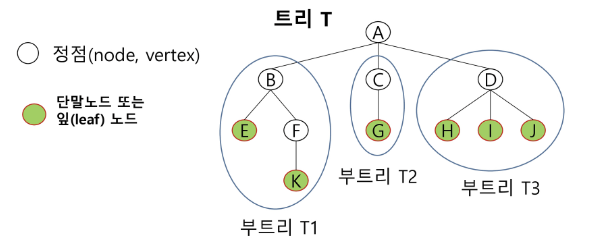
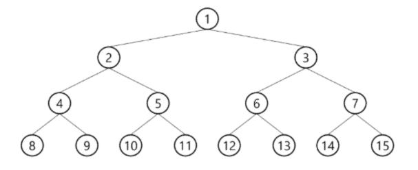
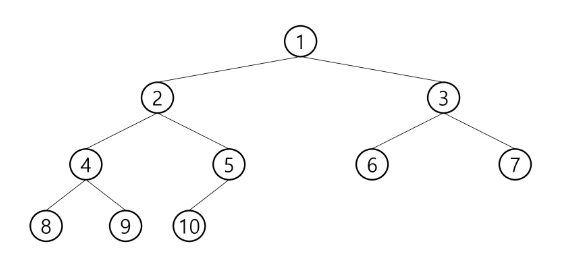
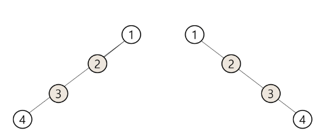
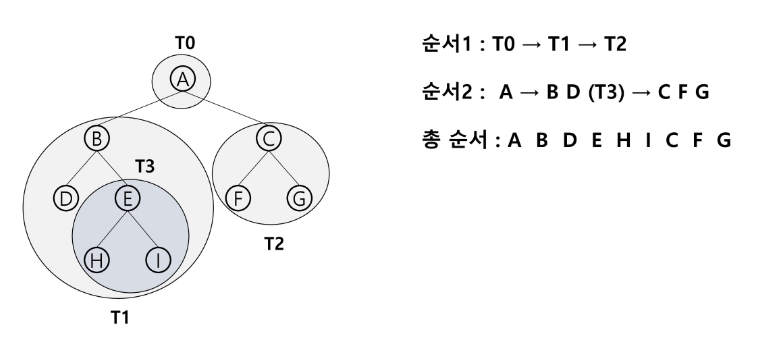
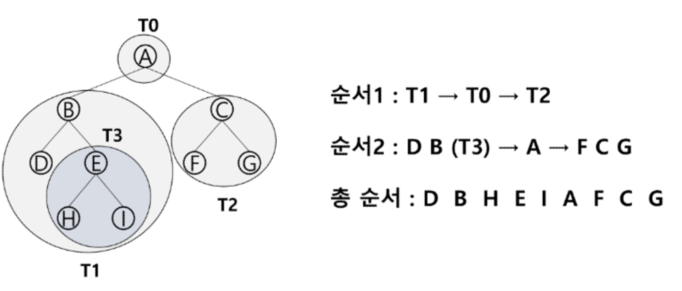
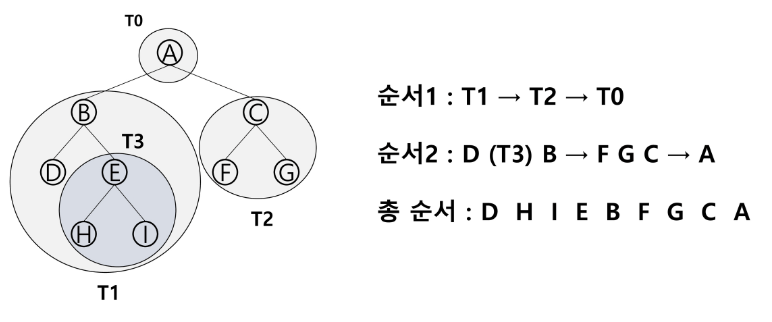
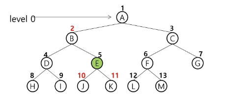
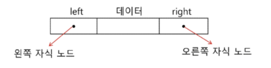
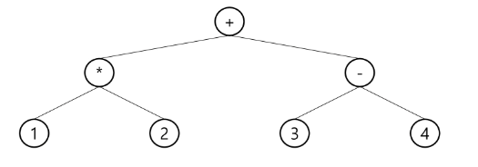

# 트리의 개념

- 비선형 구조
- 원소들 간에 1:n 관계를 가지는 자료구조
- 원소들 간에 계층관계를 가지는 계층형 자료구조
- 상위 원소에서 하위 원소로 내려가면서 확장되는 트리 모양의 구조

## 트리의 정의

- 한 개 이상의 노드로 이루어진 유한 집합이며 다음 조건을 만족한다.
  - 노드 중 최상위 노드를 루트(root)라 한다
  - 나머지 노드들은 n(≥0)개의 분리집합 T1, … , TN으로 분리될 수 있다.
- 이들 T1, … , TN은 각각 하나의 트리가 되며 루트의 subtree라 한다.



## 용어 정리

- 노드node : 트리의 원소
- 간선edge : 노드를 연결하는 선. 부모 노드와 자식 노드를 연결
- 루트 노드 root node : 트리의 시작 노드
- 형제 노드 sibling node : 같은 부모 노드의 자식 노드들
- 조상 노드 : 간선을 따라 루트 노드까지 이르는 경로에 있는 모든 노드들
- 서브 트리 subtree : 부모 노드와 연결된 간선을 끊었을 때 생성되는 트리
- 자손 노드 : 서브 트리에 있는 하위 레벨의 노드들

### 차수 degree

- 노드의 차수 : 노드에 연결된 자식 노드의 수
- 트리의 차수 : 트리에 있는 노드의 차수 중 가장 큰 값
- 단말 노드 leaf node : 차수가 0인 노드, 자식 노드가 없는 노드

### 높이

- 노드의 높이 : 루트에서 노드에 이르는 간선의 수. 노드의 레벨.
- 트리의 높이 : 트리에 있는 노드의 높이 중에서 가장 큰 값. 최대 레벨.

---

# 이진 트리

- 모든 노드들이 2개의 서브 트리를 갖는 특별한 형태의 트리
- 각 노드가 자식 노드를 최대 2개 가질 수 있는 트리
- 레벨 i에서의 노드의 최대 개수는 2^i개
- 높이가 h인 이진 트리가 가질 수 있는 노드의 최소 개수는 (h+1)개가 되며, 최대 개수는 (2^h-1)개가 된다.

### 포화 이진 트리 Full Binary Tree

- 모든 레벨에 노드가 포화 상태로 차 있는 이진 트리
- 높이가 h일 때, 최대의 노드 개수인 (2^(h+1)-1)의 노드를 가진 이진 트리
- 루트를 1번으로 하여 (2^(h+1)-1)까지 정해진 위치에 대한 노드 번호를 갖는다



### 완전 이진 트리 Complete Binary Tree

- 높이가 h이고 노드 수가 n개일 때 (h+1 ≤ n < 2^(h+1)-1) 포화 이진 트리의 노드 번호 1번부터 n번까지 빈 자리가 없는 이진 트리



### 편향 이진 트리 Skewed Binary Tree

- 높이 h에 대한 최소 개수의 노드를 가지면서 한쪽 방향의 자식 노드만을 가진 이진 트리



## 이진트리 - 순회traversal

- 순회 : 트리의 각 노드를 중복되지 않게 전부 방문
- 비선형 구조이기 때문에 선후 연결 관계를 알 수 없다

### 3가지의 기본적인 순회방법

- 전위순회 preorder traversal
  - 부모 노드 방문 후 자식 노드를 좌우 순서로 방문
- 중위순회 inorder traversal
  - 왼쪽 자식 노드, 부모 노드, 오른쪽 자식 노드 순으로 방문
- 후위순회 postorder traversal
  - 자식 노드를 좌우 순서로 방문한 후 부모 노드 방문

### 전위 순회 preorder traversal

- 수행 방법
  1. 현재 노드 n을 방문하여 처리
  2. 현재 노드 n의 왼쪽 서브트리로 이동
  3. 현재 노드 n의 오른쪽 서브트리로 이동
- 알고리즘

```python
def preorder_traverse(T):
	if T:
		visit(T)
		preorder_traverse(T.left)
		preorder_traverse(T.right)
```



### 중위 순회 inorder traversal

- 수행 방법
  1. 현재 노드 n의 왼쪽 서브트리로 이동
  2. 현재 노드 n을 방문하여 처리
  3. 현재 노드 n의 오른쪽 서브트리로 이동
- 알고리즘

```python
def inorder_traverse(T):
	if T:
		inorder_traverse(T.left)
		visit(T)
		inorder_traverse(T.right)
```



### 후위 순회 postorder traversal

- 수행 방법
  1. 현재 노드 n의 왼쪽 서브트리로 이동
  2. 현재 노드 n의 오른쪽 서브트리로 이동
  3. 현재 노드 n을 방문하여 처리
- 알고리즘

```python
def postorder_traverse(T):
	if T:
		postorder_traverse(T.left)
		postorder_traverse(T.right)
		visit(T)
```



---

## 이진 트리의 저장

- 부모 번호를 인덱스로 자식 번호를 저장
- 자식 번호를 인덱스로 부모 번호를 저장

## 이진 트리의 표현

- 배열
  - 이진 트리에 각 노드 번호를 차례로 부여 (루트 : 0)
    
- 연결 리스트
  

## 수식 트리



- 수식을 표현하는 이진 트리
