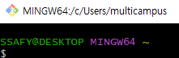
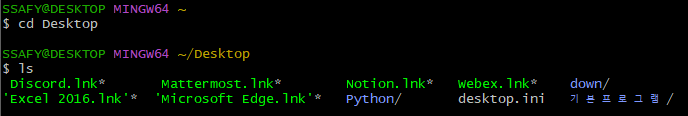

# CLI 기초 및 VScode 단축키

## CLI (Command Line Interface)

명령어를 통해 사용자와 컴퓨터가 상호작용 하는 방식

↔ **GUI (Graphic User Interface)** : 그래픽을 통해 사용자가 컴퓨터가 상호작용 하는 방식

- 컴퓨터 리소스 절약
- 화면에 전체 명령 목록을 보여줄 필요가 없다
- CLI 기반 운영체제 : Linux/Unix → Mac OS

- `~` : 현재 작업중인 위치 C:\Users\users 사용자의 홈 디렉토리
    
    
    
---

## 기본적인 명령어

| 명령어 | 내용 |
| --- | --- |
| `touch {파일명}` | 파일 생성 |
| `Mkdir {폴더명}` | 폴더 생성 |
| `ls` | 현재 작업 중인 디렉토리의 폴더/파일 목록을 보여주는 명령어 |
| `cd {폴더명}` | 하위 디렉토리로 작업 공간 변경 |
| `cd ..` | 상위 디렉토리로 작업 공간 변경 |
| `rm {파일명}` | 파일 삭제 |
| `rm -r {폴더명}` | 폴더 삭제 |
| `start, open` | 현재 위치 cmd 열기 |
| `start, open .` | 현재 위치 열기 |
| `start, open {파일/폴더명}` | 폴더/파일 열기 |
| `Tab` | 가장 비슷한 단어를 자동 출력 |
| `Tab Tab` | 비슷한 단어 목록 출력 |
| `code .` | 해당 폴더의 코드 열기 |
| `vi {파일명}` | 편집기 띄우기 |
| `:i` | 편집 모드 시작 |
| `:wq` | 저장하고 창 나가기 |
| `:q` | 창 나가기 |
| `python 파일.py` | py 파일 실행 |
| `exit()` | py 입력창 나가기 |
| `⬆️` | 여태 썼던 명령어 로그 확인 가능 |

- -r : recursive : 재귀적
- desktop.ini처럼 숨김처리 된 파일들이 있다.

---

## 경로

### 절대경로

- 루트 디렉토리부터 목적지점까지 거치는 모든 경로를 전부 작성한 것
- 윈도우 바탕 화면의 절대 경로 - C:/Users/ssafy/Desktop

### 상대경로

- 현재 작업하고 있는 디레렉토리를 기준으로 계산 된 상대적 위치를 작성한 것
- 현재 작업하고 있는 디렉토리가  C:/Users일 때 윈도우 바탕화면으로의 상대 경로는 ssafy/Desktop
- ./ : 현재 작업하고 있는 폴더
- ../ : 현재 작업하고 있는 폴더의 부모 폴더

---
