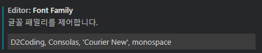

## Visual Studio Code

- font : D2Coding

| 명령어 | 내용 |
| --- | --- |
| `ctrl + k → f` | VScode에서 폴더 닫기 |
| `ctrl + shift +` ` | VScode에서 터미널 열기 |
| `ctrl + ,` | 설정 열기 |
| `Alt + Shift + 방향키` | 코드 아래로 똑같이 복사 |
| `Alt + 클릭` | 멀티 클릭 |
| `ctrl + D` | 동시 선택 |
| `Ctrl + /` | 주석 처리 |
| `Alt ⬆️, ⬇️` | 코드 순서 바꾸기 |
