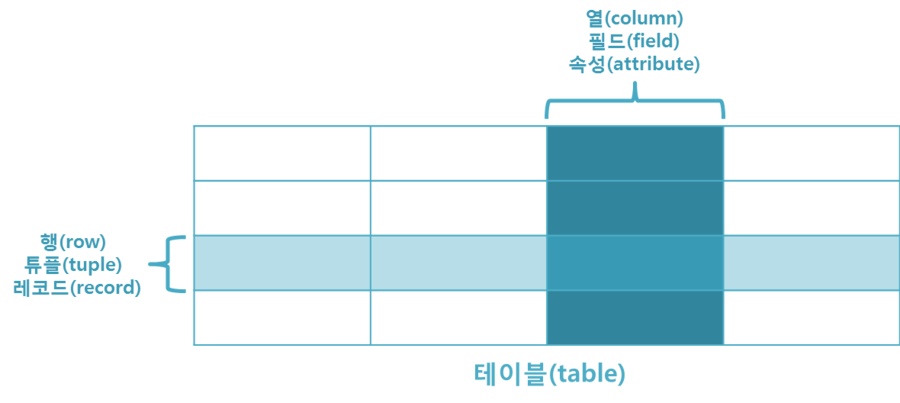
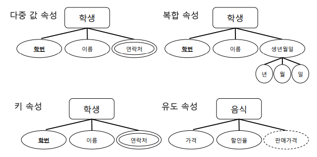
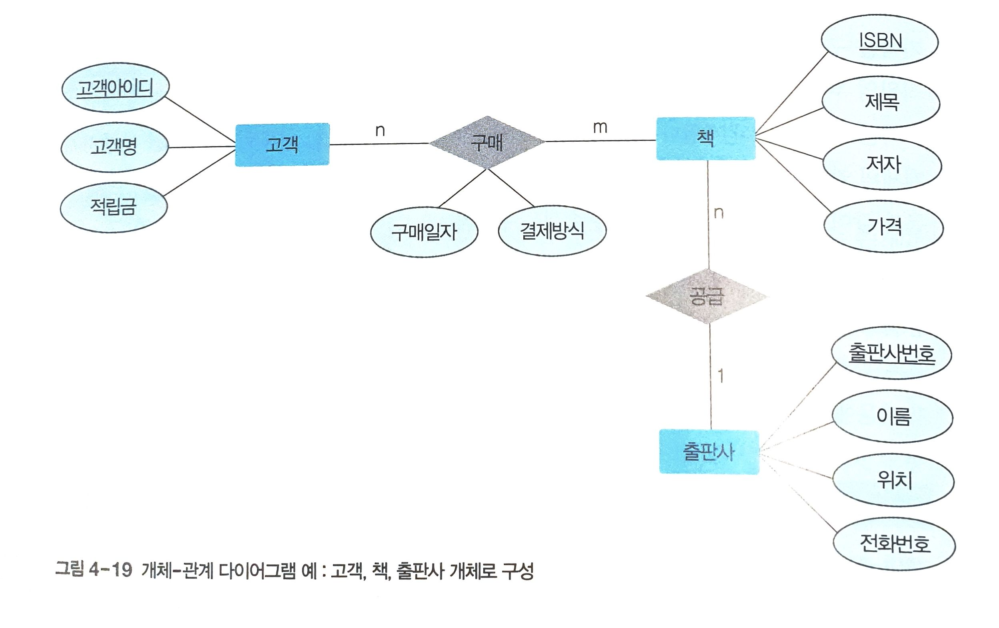
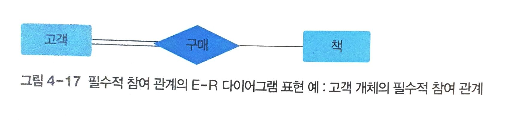
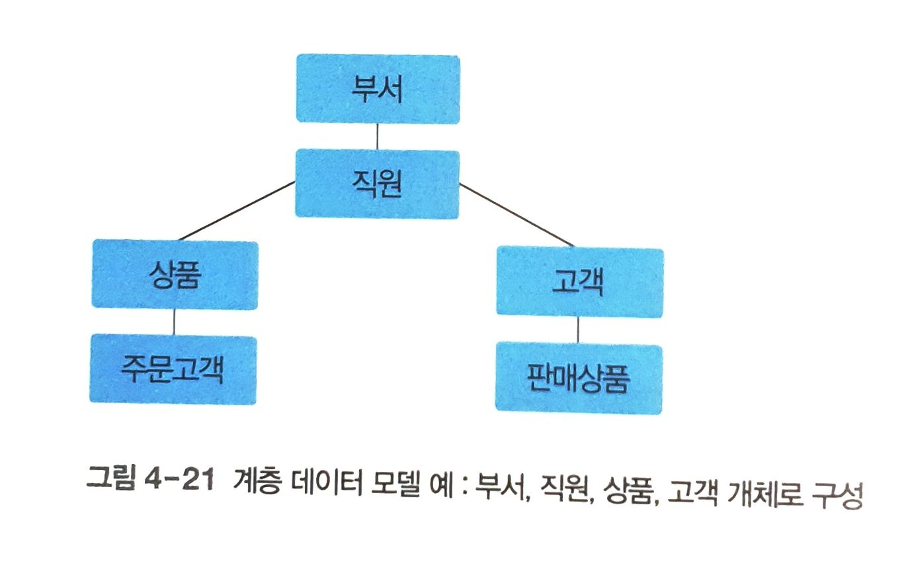
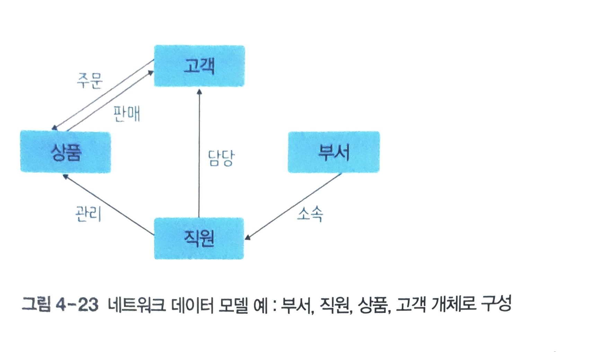

# 01 데이터 모델링과 데이터 모델의 개념

## 데이터 모델링

현실 세계에 존재하는 데이터를 컴퓨터 세계의 데이터베이스로 옮기는 변환 과정

- **개념적 데이터 모델링** : 현실 세계의 중요 데이터를 추출하여 개념 세계로 옮긴다. (추상화)
- **논리적 데이터 모델링** : 개념 세계의 데이터를 데이터베이스에 저장하는 구조로 표현한다.

## 데이터 모델

데이터 모델링의 결과물을 표현하는 도구

- **개념적 데이터 모델** : 사람의 머리로 이해할 수 있도록 현실 세계를 개념적 데이터 모델링하여 데이터베이스의 개념적 구조로 표현하는 도구
    
    ex) 개체-관계 모델
    
- **논리적 데이터 모델** : 개념적 구조를 논리적 데이터 모델링하여 데이터베이스의 논리적 구조로 표현하는 도구
    
    ex) 관계 데이터 모델
    

### 데이터 모델의 구성

- **데이터 구조 data structure**
    - 개념적 : 현실 세계를 개념 세계로 추상화했을 때 **어떤 요소로 이루어져 있는지**
    - 논리적 : 데이터를 **어떤 모습으로 저장할 것인지**
- **연산 operation**
    - 데이터 구조에서 실제로 표현된 값들을 처리하는 작업
    - 동적 (계속 변경될 수 있음)
- **제약조건 constraint**
    - 구조적 측면의 제약 사항
    - 의미적 측면의 제약 사항

---

# 02 개체-관계 모델

개체와 개체 간의 관계를 이용해 현실 세계를 개념적 구조로 표현하는 방법

## 개체 → 레코드 🔲

- 현실 세계에서 조직을 운영하는 데 꼭 필요한 사람이나 사물과 같이 구별되는 모든 것
- ex) 고객, 책 …

## 속성 → 필드 ⭕

- 개체나 관계가 가지고 있는 **고유한 특성** (가장 작은 논리적 단위)

| 속성 유형 | 설명 | 예시 |
| --- | --- | --- |
| 단일값 속성 ○ | 값을 하나만 가질 수 있는 속성  | 이름 |
| 다중값 속성 ◎ | 값을 여러 개 가질 수 있는 속성 | 연락처 |
| 단순 속성 | 의미를 더는 분해할 수 없는 속성 | 성별 |
| 복합 속성 | 의미를 분해할 수 있는 속성 | 생년월일을 년, 월, 일로 분해 가능 |
| 유도 속성 ◌ | 기존의 다른 속성의 값에서 유도되어 결정되는 속성 | 가격과 할인율로 판매가격을 유도 가능 |
| 널 속성 | 아직 결정되지 않았거나 존재하지 않는 값이 허용된 속성 - 공백, 0과는 다름 | 병역 여부 |
| 키 속성 | 각 개체를 식별하는 데 사용되는 속성 | 주민등록번호, 집 전화번호 + 이름 |

## 관계 🔷

- 개체와 개체가 맺고 있는 의미 있는 연관성
- **매핑**(mapping, 개체 집합들 사이의 대응 관계)을 의미
- 동사에 해당되는 것 ex) 고객 - <구매> - 책
- 관계 타입 - 관계 인스턴스로 표현하기도
    - 타입 : 구매 관계 / 인스턴스 : 고객 A가 데이터베이스개론 책을 삼

## 관계 유형

### 분류 1) 관계에 참여하는 개체 타입의 수

- 이항 관계 : 개체 타입 2개
- 삼항 관계 : 개체 타입 3개
- 순환 관계 : 개체 타입 1개가 자기 자신과 맺는 관계

### 분류 2) 매핑 카디널리티 (매핑 원소의 수)

- **1 : 1 일대일 관계**
    - 개체 사이에 하나의 관계만을 맺을 수 있을 때
- **1 : N 일대다 관계**
    - 개체 A는 여러 개체 B와 관계를 맺을 수 있지만,
    - 개체 B는 하나의 개체 A와만 관계를 맺을 수 있을 때
- **N : M 다대다 관계**
    - 개체 A는 여러 개체 B와 관계를 맺을 수 있고,
    - 개체 B도 여러 개체 A와 관계를 맺을 수 있을 때

## 관계의 참여 특성

### 필수적 참여한다, 전체 참여한다

- 개체의 **모든 인스턴스가 관계에 반드시 참여**해야 한다.
    - ex) 모든 고객이 책을 구매해야 한다 → 고객 개체가 구매 관계에 필수적으로 참여

### 선택적 참여한다, 부분 참여한다

- 개체의 **일부 인스턴스만 관계에 참여**해도 된다.
    - ex) 구매되지 않은 책도 있다 → 책 개체가 구매 관계에 선택적으로 참여

## 관계의 종속성

### 존재 종속 : 개체 B가 개체 A에 종속되어 있다.

- 개체 A : **강한 개체(오너 개체)** / 개체 B : **약한 개체(종속 개체)**
    - 약한 개체 : 강한 개체의 키를 외래키로 사용
    
    <aside>
    💡 **구별자, 부분키**
    
    - 강한 개체 내부에서 약한 개체를 구별해주는 속성
        
        ex) 반 이름 : 서울 캠퍼스(강한 개체) - 1반, 2반 …(약한 개체)
        
    </aside>
    
- 개체 B는 독자적으로 존재할 수 없고 개체 A의 존재 여부에 의존적이다.
- 개체 A가 삭제되면 자동으로 개체 B도 삭제된다.

---

# 03 논리적 데이터 모델

- 데이터베이스 관리 시스템의 종류가 중요

| 데이터 모델 | 데이터베이스의 논리적 구조 |
| --- | --- |
| 관계 데이터 모델 ⭐ | 2차원 테이블 형태 |
| 계층 데이터 모델 | 트리 형태 |
| 네트워크 데이터 모델 | 그래프(네트워크) 형태 |

### 계층 데이터 모델 - tree

1. **연결선**으로 관계 표현
2. 일대다 관계만 표현 (다대다 x)
3. 두 개체 사이에 하나의 관계만 존재 (상하관계-**부모자식 관계**)
    1. 부모 개체는 여러 자식 개체를 가질 수 있음
    2. 자식 개체는 하나의 부모 개체만을 가짐
4. 사이클 존재 X
- 단점
    - 관계 정의에 제약이 큼
    - 연산과 검색이 어려움

### 네트워크 데이터 모델 - graph

1. **화살표**로 관계 표현
2. 일대다 관계만 표현 (다대다 x)
3. **두 개체 사이에 여러 관계 가능** (이름으로 구별)
    1. 오너 개체는 여러 멤버 개체를 가질 수 있음
    2. 멤버 개체도 여러 오너 개체를 가질 수 있음
4. 오너 → 멤버 관계
- 장점
    - 자연스러운 모델링 가능
    - 복잡한 구조로 연산과 검색이 더욱 어려움

### 기타

- 객체지향 데이터 모델
- 객체관계 데이터 모델