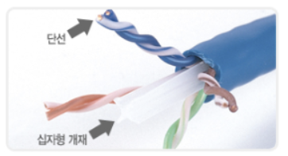
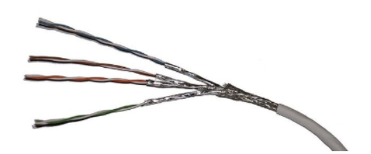
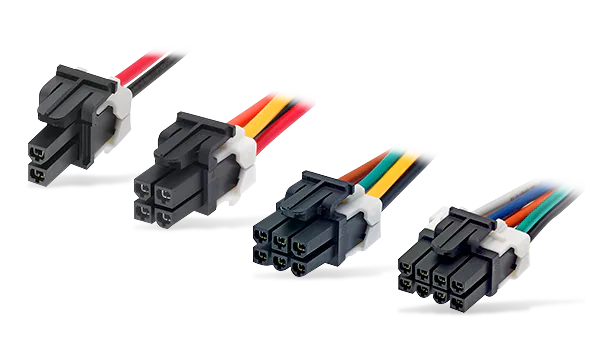

- [**트위스트 페어 케이블**](#트위스트-페어-케이블)
- [**다이렉트 케이블과 크로스 케이블**](#다이렉트-케이블과-크로스-케이블)
    + [다이렉트 케이블](#다이렉트-케이블)
    + [크로스 케이블](#크로스-케이블)

 

---

# 트위스트 페어 케이블

- 네트워크 전송 매체 : 데이터가 흐르는 물리적인 선로
 
    - 무선
        - 라디오파, 마이크로파, 적외선
         
    - 유선
        - 트위스트 페어 케이블 (랜 케이블 = 랜 선)
            1. UTP 케이블
                - 실드로 보호 x
                - 데이터 전송 품질(규격·속도)에 따라 분류 가능
                
                
                
            2. STP 케이블
                - 실드로 보호 o → 노이즈 방어 가능
                
                
                
            - 커넥터 (RJ-45)
                
                
                
        - 광케이블
    
    ---
    
    # 다이렉트 케이블과 크로스 케이블
    
    ⭐ 모두 1, 2, 3, 6번 구리선만 사용
    
    ⭐ 컴퓨터는 1, 2번 구리선으로 데이터를 전송
    
    ### 다이렉트 케이블
    
    - 구리선 여덟개를 같은 순서로 커넥터에 연결
    - 컴퓨터와 스위치를 연결
    
    ### 크로스 케이블
    
    - 1·2번 케이블을 다른쪽 커넥터의 3·8번에 연결
    - 컴퓨터 간 직접 랜 케이블로 연결
    
    ---
    
    <aside>
    💡 <b>인터페이스</b>
    
    - 컴퓨터·라우터의 인터페이스 : MD
    - 스위치·허브의 인터페이스 : MDI-X
    - MD ↔ MDI-X : 다이렉트 케이블 사용
    - MD ↔ MD, MDI-X ↔ MDI-X : 크로스 케이블 사용
    </aside>
    
     

    <aside>
    💡 <b>auto MDIX</b>
    
    - 다이렉트 케이블과 크로스 케이블을 자동으로 판단하는 기능
    - 배선 실수 방지 가능
    
    </aside>
