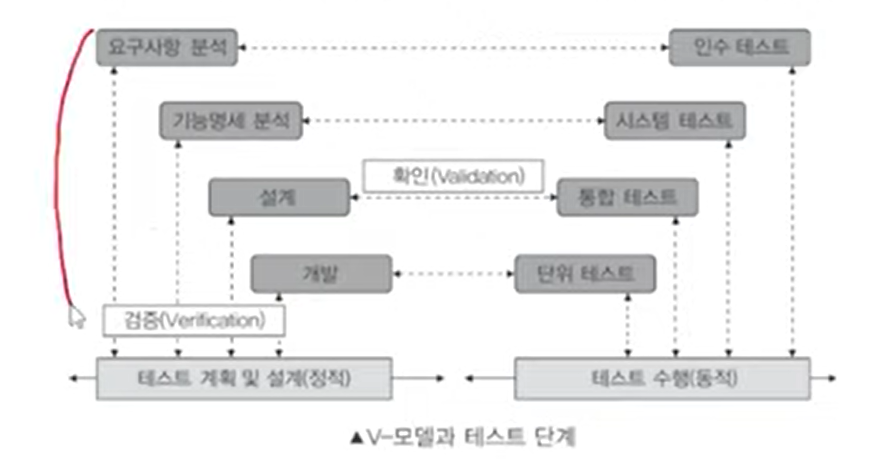
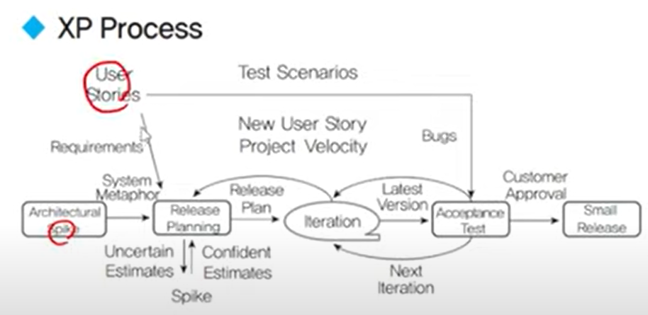

### 시스템의 기본 요소

### 소프트웨어 위기

- 하드웨어 비용을 초과하는 개발 비용의 증가
- 개발 기간의 지연
- 개발 인력 부족 및 인건비 상승
- 성능 및 신뢰성 부족
- 유지보수의 어려움에 따른 엄청난 비용

### 소프트웨어 재공학의 과정

분석 → 구성 → 역공학(재문서화) → 이식

- Preventive Maintenace

### CASE(Computer Aided Software Engineering)

소프트웨어 개발과정을 자동화하는 작업

비용 절약, 생산성 향상

- 상위 CASE : 요구 분석 및 설계 지원
  - SADT : 구조적 설계 도구
- 하위 CASE : 코딩 지원
- 통합 CASE: 전체 과정 지원

## 소프트웨어 설계 방법론

### 소프트웨어 생명주기

타당성 검토 → 개발 계획 → 요구사항 분석 → 설계 → 구현 → 테스트 → 운용 → 유지보수

### 폭포수 모형 (Waterfall) : 순차적

### 나선형 모형 (Spiral) : 반복적

- 계획 수립 → **위험 분석** → 개발 및 검증(프로토타입) → 고객 평가 → 계획 수립…

### 하향식과 상향식 설계

- 하향식 : Main User Function에서 하위 기능들로 나눠가며 설계
- 상향식 : 가장 기본적인 컴포넌트를 먼저 설계, 이후 이것을 사용하는 상위 컴포넌트 설계

### 프로토타입 모형 : 고객과의 커뮤니케이션 향상

### HIPO : 입력, 처리, 출력. 계층적 입력 처리 출력.

- 가시적 도표, 총체적 다이어그램, 세부적 다이어그램
- 하향식 소프트웨어 개발을 위한 문서화 도구

### V-모델

- 폭포수 모형에서 시스템 검증과 테스트 작업을 강조

## 애자일 개발 방법론

### 선언문

- 개인과의 소통

### 익스트림프로그래밍(XP) : 빠르게

- 소통, 단순성, 피드백, 용기, 존중

- User Story : 요구사항
- Release Planning : 부분적으로 기능이 완료된 제품을 제공
- Iteration 릴리즈를 세분화한 단위 (1~3주)
- 적응 테스트
- Small release : 릴리즈 단위를 기능별로 세분화
- 12가지 실천 사항
  - 짝 프로그래밍
  - Planning Game
  - Test Driven Development
  - Whole Team : 고객을 팀에 포함
  - Continuous Integration : 상시 빌드 및 배포할 수 있는 상태로 유지
  - Design Improvement : 기능 변경 없이 재구성 수행
  - Small Releases
  - Coding Standards
  - Collective Code Ownership : 모든 소스를 다 볼 수 있다
  - Simple Design : 가능한 가장 간결한 디자인 상태 유지
  - System Metaphor : 최종적으로 개발되어야 할 시스템 구조 기술
  - Sustainable Pace : 오버타임 금지

### 효과적인 프로젝트 관리를 위한 3대 요소

- 사람
- 문제
- 프로세스

### 스크럼

- 스크럼 팀의 역할
  - 제품 책임자 : 개발 목표에 이해도가 높은 개발 의뢰자
  - 스크럼 마스터 : 배분
  - 스크럼 팀
- 과정
  - Product Backlog
  - Sprint

### 그 외 애자일 기법

- 린
- DSDM 동적 시스템 개발 방법론
- FDD 기능 중심 개발

## 현행 시스템 분석

### 현행 시스템 파악 절차

1. 시스템(조직) 구성 파악 - 시스템 기능 파악 - 시스템 인터페이스 현황 파악
2. 아키텍쳐 파악 - 소프트웨어 구성 파악
3. 시스템 하드웨어 현황 파악 - 네트워크 구성 파악

### 시스템 인터페이스 현황 파악

- 시스템 구성 파악
  - 문서화
  - 기간 업무, 지원 업무로 구분하여 기술
- 시스템 기능 파악
- 인터페이스 현황 파악
  - 현행 시스템의 단위 업무 시스템이 타 단위 업무 시스템과 서로 주고받는 데이터 유형, 형식, 종류, 프로토콜 및 주기 등을 명시
- EAI : 기업 내의 컴퓨터 어플리케이션들을 현대화, 통합, 조정하는 것을 목표로 세운 계획, 방법, 도구
- FEP : 입력 데이터를 미리 처리하는 프로그램

### 소프트웨어, 하드웨어, 네트워크 현황 파악

- 라이선스 적용 방식, 수 등 파악
- 서버 사양, 이중화 등 파악
- 네트워크 현황, 개발 기술 환경 분석

### 플랫폼

- 기반 시설
- 응용, 하드웨어, 시스템 소프트웨어
- 종류 : JAVA 플랫폼, IOS, 윈도우 등
- 플랫폼 성능 특성 분석
  - 특성 분석 항목 : 응답 시간, 가용성, 사용률
  - 특성 분석 방법 : 기능 테스트, 사용자 인터뷰, 문서 점검

### 현행 시스템의 OS 분석

- 분석 항목 : 종류, 버전
- 고려사항 : 가능성, 성능, 기술 지원, 주변기기, 구축 비용
- 메모리 누수 : 실행 SW가 정상 종료되지 않고 남아있는 증상

### 오픈소스 라이선스 종류

- ex) Linux
- GNU : 컴퓨터 프로그램은 물론 모든 관련 정보를 돈으로 주고 구매하는 것을 반대하는 것이 기본 이념
- BNU GPLv1 : 소스 코드를 공개하지 않으면서 바이너리만 배포하는 것을 금지
- BSD : 수정할 수 있고, 수정한 것을 배포할 수 있음. 재배포는 의무 사항이 아님. 공개하지 않아도 되는 상용 소프트웨어에서도 사용할 수 있음
- Apache 2.0 : Apache 재단 소유의 SW 적용을 위해 제공하는 라이선스. 수정배포시 Apache 2.0을 포함해야 함. ex) Android, HADOOP

### 현행 시스템 DBMS 분석

- 데이터베이스 관리 시스템
- 종속성, 중복성의 문제를 해결하기 위해 제안된 시스템
- 데이터의 중재자
