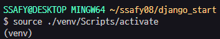

# Django Intro

## Framework 이해하기

- 서비스 개발에 필요한 기능들을 미리 구현해서 모아 놓은 것
    - 일정한 뼈대, 틀을 가지고 일하다
    - 특정 프로그램을 개발하기 위한 여러 도구들과 규약을 제공하는 것
- 복잡한 문제를 해결하거나 서술하는데 사용되는 기본 개념 구조
- 소프트웨어의 생산성과 품질을 높임

## Web 이해하기

### www (World Wide Web)

- 전 세계에 퍼져 있는 거미줄 같은 연결망
    - 촘촘하고 거대한 유선(해저 케이블)로 연결 → 전봇대
    - 스타링크 프로젝트 : 소형 위성으로 무선 연결
- 인터넷을 이용한다 = 전세계의 컴퓨터가 연결되어 있는 하나의 인프라를 이용한다

## 클라이언트와 서버

- 대부분의 웹 서비스는 클라이언트-서버 구조를 기반으로 동작


### 클라이언트

- 웹 사용자의 인터넷에 연결된 장치(컴퓨터, 모바일)
- 웹 브라우저
- 서비스를 요청하는 주체

### 서버

- 웹 페이지, 사이트 또는 앱을 저장하는 컴퓨터
- 클라이언트가 웹 페이지에 접근하려고 할 때 서버에서 클라이언트 컴퓨터로 웹 페이지 데이터를 응답해 사용자의 웹 브라우저에 표시됨
- 요청에 대해 서비스를 응답하는 주체
1. 인터넷에 연결된 전세계 어딘가에 있는 구글 컴퓨터에게 ‘Google홈페이지.html’ 파일을 달라고 요청
2. 구글 컴퓨터는 요청을 받고 인터넷을 통해 ‘Google홈페이지.html’ 파일을 응답
3. 전달 받은 ‘Google홈페이지.html’ 파일을 웹 브라우저가 우리가 볼 수 있도록 해석

### 웹 브라우저

웹 페이지 파일을 우리가 보는 화면으로 바꿔주는(렌더링 rendering) 프로그램

### 웹 페이지

- 웹에 있는 문서. 보이는 화면 한 장 한장.
- **정적 웹 페이지**
    - 있는 그대로 제공(served as-is)
    - 한번 작성된 HTML 파일의 내용이 변하지 않고 모든 사용자에게 동일한 모습으로 전달
- **동적 웹 페이지**
    - 사용자의 요청에 따라 웹 페이지에 추가적인 수정이 되어 클라이언트에게 전달되는 웹 페이지
    - 웹 페이지의 내용을 바꿔주는 주체 : **서버**

---

# Django 구조 이해하기 ⭐

## Design Pattern

- **자주 사용되는 구조를 일반화해서 하나의 공법으로 만들어 둔 것**
- 소프트웨어에서의 관점
    - 각기 다른 기능을 가진 다양한 응용 소프트웨어를 개발할 때 공통적인 설계 문제가 존재.
    - 이를 처리하는 해결책 사이에도 공통점이 있다는 것을 발견
    - 이러한 유사점을 패턴이라 함
- 소프트웨어 디자인 패턴의 목적
    - 특정 문맥에서 공통적으로 발생하는 문제에 대해 재사용 가능한 해결책을 제시
- 소프트웨어 디자인 패턴의 장점
    - 커뮤니케이션이 매우 간단해짐 “우리 이거 클라이언트-서버 구조로 구현하자”
    

## Django’s Design Pattern

- **MVC 디자인 패턴**을 기반으로 한 **MTV 패턴** ⭐

### MVC 소프트웨어 디자인 패턴

- 하나의 큰 프로그램을 세가지 역할로 구분한 개발 방법론
1. **Model** : 데이터와 관련된 로직을 관리
2. **View** : 레이아웃과 화면을 처리
3. **Controller** : 명령을 model과 view 부분으로 연결

### **MTV 패턴**

1. **Model**
    - **데이터**와 관련된 로직을 관리
    - 응용 프로그램의 데이터 구조를 정의하고 데이터베이스의 기록을 관리
2. **Template**
    - 레이아웃과 **화면**을 처리
    - 화면상의 사용자 인터페이스 구조와 레이아웃을 정의
3. **View**
    - **Model & Template** 관련 로직 처리 및 응답 반환
    - 클라이언트의 요청에 대해 처리를 분기하는 역할

---

# Django Quick Start

### 가상환경 설정 및 활성화 → 설치





### 패키지 목록 생성


<aside>
🤖 LTS (LongTerm Support 장기 지원 버전) : 장기간에 걸쳐 지원하도록 고안된 소프트웨어 버전.

</aside>

### 프로젝트 생성

`$ django-admin startproject firstpjt .`

- .을 붙이지 않을 경우 현재 디렉토리에 프로젝트 디렉토리를 새로 생성
- collection of apps
- 프로젝트에는 여러 앱이 포함될 수 있음.
- 앱은 여러 프로젝트에 있을 수 있음.

### 서버 실행

- `$ pyhton [manage.py](http://manage.py) runserver`

### 프로젝트 구조


- `[asgi.py](http://asgi.py)` : Django 애플리케이션이 비동기식 웹 서버와 연결 밑 소통하는 것을 도움
- `setting.py` : Django 프로젝트 설정을 관리
- `urls.py` : 사이트의 url과 적절한 views의 연결을 지정 📨우편배달부
- `[wsgi.py](http://wsgi.py)` : Django 애플리케이션이 웹 서버와 연결 밑 소통하는 것을 도움
- `manage.py` : Django 프로젝트와 다양한 방법으로 상호작용하는 커맨드라인 유틸리티

### 애플리케이션 생성

- `$ python manage.py startapp articles`
- 앱은 실제 요청을 처리하고 페이지를 보여주는 등의 역할을 담당
- 일반적으로 앱은 하나의 역할 및 기능 단위로 작성

### 프로젝트 구조


- `migrations` : 데이터베이스변경 히스토리
- `admin.py` : 관리자용 페이지를 설정하는 곳
- `apps.py` : 앱의 정보가 작성된 곳
- `models.py` : 애플리케이션에서 사용하는 Model을 정의하는 곳
- `test.py` : 프로젝트의 테스트 코드를 작성하는 곳
- `views.py` : view 함수들이 정의되는 곳

### 애플리케이션 등록


- 앱을 사용하기 위해 INSTALLED_APPS 리스트에 추가
- **반드시 생성 후 등록**

---

### 요청과 응답 : URL → VIEW → TEMPLATE ⭐

### URL

- url에 따라 view에 요청 꽂아주기

### **View**

- HTTP 요청을 수신하고 HTTP 응답을 반환하는 함수 작성
- Template에게 HTTP 응답 서식을 맡김
- `render(request, template_name, context)`
    - 주어진 템플릿을 주어진 컨텍스트 데이터와 결합하고 렌더링 된 텍스트와 함께 HttpResponse 객체를 반환
    1. `request` : 응답을 생성하는데 사용되는 요청 객체
    2. `template_name` : 템플릿의 전체 이름 또는 템플릿 이름의 경로
    3. `context` : 템플릿에서 사용할 데이터 (dict)

### Templates

- 파일의 구조나 레이아웃을 정의

---

# Django Template

- 데이터 표현을 제어하는 도구이자 표현에 관련된 로직
- HTML 정적 부분과 동적 컨텐츠 삽입

## Django Template Language (DTL) Syntax

### 1. variable

- `{{ variable }}`
- dot(.)를 사용하여 변수 속성에 접근할 수 있음
- render()의 context로 넘겨주며, 여기서 정의한 key에 해당되는 문자열이 template에서 사용 가능한 변수명이 됨

### 2. Filters

- `{{ variable|filter }}`
- 표시할 변수를 수정할 때 사용

### 3. Tags

- ``
- 출력, 반복, 논리
- ``

### 4. Comments

- `{# #}`
    
    ```html
    
    	여러 줄
    	주석
    
    ```
    

### 템플릿 상속 Template Inheritance

- 코드의 재사용성에 초점
- skeleton 템플릿 만들기
- ``
    - 자식 템플릿이 부모 템플릿을 확장한다는 것을 알림
- ``
    - 하위 템플릿에서 재지정overridden할 수 있는 블록을 정의
- 추가 템플릿 경호 추가하기
    - `BASE_DIR/'templates',`
        
        


---


