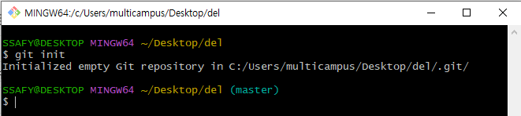
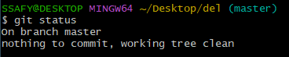
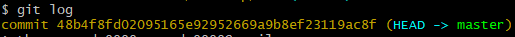

# Git 기초 : 소개와 commit
## Git : **분산 버전 관리 프로그램**

- 버전 : 컴퓨터 소프트웨어의 특정 상태
- 관리 : 어떤 이의 사무, 시설이나 물건의 유지
    -  코드를 서로 비교/ 확인

↔ **중앙집중** : 버전 관리 히스토리only one

## Git hub

- 저장소 서비스를 제공하는 서버
- 깃 기반의 저장하는 서버 자체를 마음대로 설정할 수 있다.

### 깃은 필수다! #1일1커밋

---

## Git 기본

### README.md
* 특정 레포지토리나 폴더를 소개하는 기본적인 문서

### Repository

* 특정 디렉토리를 버전 관리하는 저장소

* `git init` 로컬 저장소 생성

* **master** 표시되는 곳은 **깃으로 버전 관리가 되는 곳**

---

### → 특정 버전으로 남긴다 = “커밋(Commit)한다”

### 커밋은

- 파일이 아닌 **수정사항**만을 저장!
- 세 가지 영역을 바탕으로 동작!

1. **Working Directory** : 내가 작업하고 있는 실제 디렉토리
    1. 파일 신규 생성 `untracked`
    2. Working Directory → `git add` → Staging Area
    3. `untracked` → `tracked`
2. **Staging Area** : 커밋으로 남기고 싶은, 특정 버전으로 관리하고 싶은 파일이 있는 곳. 특정 버전으로 관리하고 싶은 변경상태들이 잠깐 머무는 곳.
    1. Git으로 버전관리 된 상태 `staged` 
    2. Staging Area → `git commit` → Repository
    3. `tracked` → `committed`
3. **Repository** : 커밋들이 저장되는 곳 (.git sirectory)
    1. 파일 수정 `modified`
    2. Working Directory →`git add` → Staging Area
    3. 반복!

---

## Git Bash 이용하여 Commit하기

### `git status`

- 현재 Git으로 관리되고 있는 파일들의 상태를 알 수 있음

- 코딩 전에 이 화면이 보여야 함. 모든 커밋이 완료됨.

### `git add .`

- 디렉토리의 모든 파일을 **Staging Area에** 올리기

### `git add 파일명`

- 특정 파일을 **Staging Area**에 올리기

### `git commit -m "한줄 커밋 메세지"`

- 커밋 메세지 : 영어가 좋긴 하지만 알아볼 수 있어야 함!

### `git log`

- 깃 로그 확인하기

- commit {커밋 아이디}
- 보통 앞 네 자리만으로 구분 가능

### `git diff {커밋아이디A} {커밋아이디B}`

- A에서 B로 어떻게 변경되었는지 확인

### `git config --global user.name “seoda0000”`

### `git config --global user.email “seoda0000@gmail.com”`

- user 기본 설정

### `git config --local user.name “seoda0000”`

- local : 이 폴더는 이것을 사용해