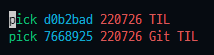

# Git Tip : 잔디밭 복구하기

## 기존 커밋 정보 수정하기

### 이메일이나 사용자 이름 불일치로 올라가지 않은 잔디밭 복구하기

---

Github와 커밋 이메일, 아이디가 다르면 잔디밭이 채워지지 않는다.

이때 커밋의 정보를 수정하여 잔디밭을 채울 수 있다.

1. `git log` 로 문제 커밋 직전 커밋 ID 확인
2. `git rebase -i 직전커밋ID`
3. 수정할 커밋의 `pick`을 `edit`으로 바꾸기
    
    (잘 수정되지 않는 경우 enter을 치고 새로운 줄에 똑같이 입력하자)
    
    
    
4. `esc` → `:wq` 로 해당 파일 저장
5. `git commit --amend --author="이름 <본인 이메일>”`
6. 다음 파일 처리 : `git rebase --continue`
7. `git push origin +브랜치이름` 원격 저장소로 강제 push 하기