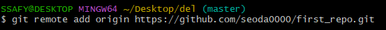
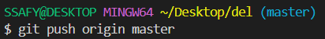
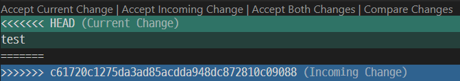

# Git 기초2 : remote-repo와 연결
## remote, clone, push, pull

### Repository
#### Local Repository

- 컴퓨터에 있는 레퍼지토리

#### Remote Repository

- 어딘가(ex. Github)에 있는 레퍼지토리

---

### `git remote add origin {remote_repo}`

- origin : repo name 별명. 관례상 origin이라고 적음.
* Remote Repository에 Local Repository 연결하기

### `git clone {remote_repo}`

* Remote Repository를 Local Repository에 복사하기

### `git push {어디로 push} {push할 branch이름}`

- branch 기본 이름 : master
* branch를 Remote Repository에 push하기

### `git push --set-upstream origin master`

- git push의 기본 경로 설정

### `git pull`

- clone으로 연결된 Remote Repository 가져오기

---

### 💥Conflict (충돌)

- Pull 했을 때 Local Repository과 Remote Repository가 충돌한 경우

- **HEAD** : 로컬이 보는 데이터
- **Incoming Change** : Pull 했을 때 여기에 들어가야 할 데이터
- 직접 정리한 후 다시 `Add-Commit-Push` 해주면 된다.