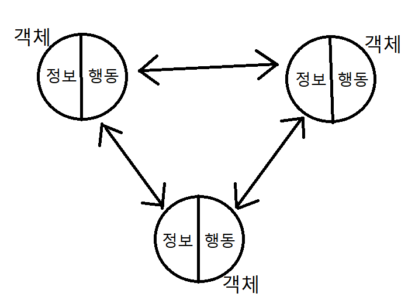

- [**객체지향 프로그래밍 OOP**](#객체지향-프로그래밍-OOP)
    + [객체 지향 프로그래밍이란?](#객체-지향-프로그래밍이란?)
    + [객체지향의 장단점](#객체지향의-장단점)
- [**객체**](#객체)
    + [클래스 Class](#클래스-Class)
    + [인스턴스 Instance](#인스턴스-Instance)
    + [인스턴스와 클래스 간의 이름 공간 namespace](#인스턴스와-클래스-간의-이름-공간-namespace)
- [**속성**](#속성)
    + [인스턴스 변수](#인스턴스-변수)
    + [클래스 변수](#클래스-변수)
- [**메서드 Method**](#메서드-Method)
  * [인스턴스 메서드](#**인스턴스-메서드**)
    + [생성자 메서드 Constructor](#**생성자-메서드-Constructor**)
    + [매직 메서드 (스페셜 메서드)](#**매직-메서드**-(스페셜-메서드))
  * [클래스 메서드](#**클래스-메서드**)
    + [데코레이터](#데코레이터)
  * [스태틱(정적) 메서드](#스태틱(**정적)-메서드**)
- [**객체지향의 핵심 개념**](#객체지향의-핵심-개념)
  * [추상화](#추상화)
  * [상속 Inheritance](#상속-Inheritance)
    + [다중 상속](#다중-상속)
    + [상속 관련 함수와 메서드](#상속-관련-함수와-메서드)
  * [다형성 Polymorphism](#다형성-Polymorphism)
  * [캡슐화 Encapsulation](#캡슐화-Encapsulation)
    + [Public Member](#Public-Member)
    + [Protected Member](#Protected-Member)
    + [Private Member](#Private-Member)
    + [getter 매서드와 setter 매서드](#getter-매서드와-setter-매서드)


# 객체지향 프로그래밍 OOP

### 객체 지향 프로그래밍이란?

- 컴퓨터 프로그래밍의 패러다임(방법론) 중 하나
- 컴퓨터 프로그램을 객체들의 모임으로 파악
- 각각의 객체는 메세지를 주고받고 데이터를 처리할 수 있다.
- 데이터와 기능(메서드) 분리, 추상화된 구조(인터페이스)



- 객체지향 프로그래밍이 필요한 이유
    - **추상화** : 현실 세계를 프로그램 설계에 반영 (복잡한 거 숨기고 필요한 거 드러내고)


**↔ 절차지향 프로그래밍**

- 데이터와 함수로 인한 변화. 특정 과정의 수정이 어려움.
- 컴퓨터의 처리구조와 비슷해서 실행 속도가 빠름

### 객체지향의 장단점

- **장점**
    - **클래스 단위로 모듈화**시켜 개발할 수 있으므로 많은 인원이 참여하는 대규모 소프트웨어 개발에 적합
    - 필요한 부분만 수정하기 쉽기 때문에 **프로그램의 유지보수가 쉬움**
- **단점**
    - 설계 시 많은 노력과 시간이 필요
        - 다양한 객체들의 상호 작용 구조를 만들기 위해
    - 실행 속도가 상대적 느림

---

# 객체

- **클래스에서 정의한 것을 토대로 메모리(실제 저장공간)에 할당**된 것
- 프로그램에서 사용되는 데이터 또는 식별자에 의해 참조되는 공간
- **속성(변수)과 행동(함수-메서드)으로 구성된 모든 것** ⭐
- 파이썬은 모든 것이 객체(속성 + 행동)
    - ex) 변수, 자료구조, 함수, 메서드…
- 객체는 특정 타입의 인스턴스

- **특징**
    - **타입(type)** : 어떤 연산자(operator)와 조작(method)이 가능한가?
    - **속성(attribute)** : 어떤 상태(데이터)를 가지는가?
    - **조작법(method)** : 어떤 행위(함수)를 할 수 있는가?
    
- **비교하기**
    - **== : 동등한(equal)**
        - 쌍둥이. 변수가 참조하는 객체가 내용이 같은 경우
    - **is : 동일한(identical)**
        - 분신술. 변수가 동일한 객체를 가리키는 경우.
    
    ```python
    a = [1, 2, 3]
    b = [1, 2, 3]
    
    print(a == b, a is b)  # True False
    
    a = [1, 2, 3]
    b = a
    print(a == b, a is b)  # True True
    ```
    

### 클래스 Class

- `class MyClass:`
- 객체들의 분류 / 설계도. 타입.
- 클래스는 꼭 PascalCase로 호출

### 인스턴스 Instance

- `my_instance = MyClass()`
- 클래스로 만든 객체. 하나하나의 실체.

### 인스턴스와 클래스 간의 이름 공간 namespace

- 클래스를 정의하면 클래스와 해당하는 이름 공간 생성
- 인스턴스를 만들면 인스턴스와 해당하는 이름 공간 생성
- 인스턴스에서 특정 속성에 접근하면, **인스턴스-클래스** 순으로 탐색

---

# 속성

- `my_instance.my_attribute`
- 특정 데이터 타입/클래스의 객체들이 가지게 될 상태/데이터
- **클래스 변수**/**인스턴스 변수**

```python
class Person: 
    blood_color = 'red'  # 클래스 변수
    population = 100  # 클래스 변수

    def __init__(self, name):  
        self.name = name  # 인스턴스 변수

jimin = Person('지민')
print(jimin.name)  # 지민  
```

### 인스턴스 변수

- 인스턴스가 **개인적으로** 가지고 있는 속성
- 각 인스턴스들의 고유한 변수
- 생성자 메서드`__init__` 에서 `self.<name>`을 정의
- 인스턴스가 생성된 이후 `<instance>.<name>`으로 접근 및 할당

```python
class Person:
    def __init__(self, name):  # 인스턴스 변수 정의
        self.name = name 

jimin = Person('지민')
print(jimin.name)  # 지민  # 인스턴스 변수 접근 및 할당
jimin.name = '박지민'
print(jimin.name)  # 박지민
```

### 클래스 변수

- 클래스 선언 내부에서 **공용으로** 가지고 있는 속성
- 접근 및 할당 시 항상 `<classname>.<name>` 이용 ⭐

```python
class Circle():
    pi = 3.14  # 클래스 변수 정의

    def __init__(self, r):
        self.r = r # 인스턴스 변수

c1 = Circle(5)
c2 = Circle(10)

print(Circle.pi)  # 3.14
print(c1.pi)  # 3.14
print(c2.pi)  # 3.14

Circle.pi = 5    # 클래스 변수 변경
print(Circle.pi)  # 5
print(c1.pi)  # 5
print(c2.pi)  # 5
```

- 활용하기

```python
class Person:
    count = 0

    def __init__(self, name):
        self.name = name
        Person.count += 1
```

---

# 메서드 Method

- `my_instance.my_method()`
- 특정 데이터 타입/클래스에 객체에 공통적으로 적용 가능한 행위(함수)

## **인스턴스 메서드**

- 인스턴스 변수를 사용하거나, 인스턴스 변수에 값을 설정
- 클래스 내부에 정의되는 메서드의 기본
- 호출 시 첫번째 인자로 인스턴스 자기자신`self`이 전달됨
- **클래스 변수, 인스턴스 변수 둘 다 사용이 가능**

```python
class Mycalss:
	
    def instance_method(self, arg1, ...):

my_instance = MyClass()
my_instance.instance_method(...)
```

- `self` : 인스턴스 자기자신

### **생성자 메서드 Constructor**

- **인스턴스 객체가 생성될 때** 자동으로 호출되는 메서드
- 인스턴스 변수들의 **초기값**을 성정
    - 인스턴스 생성 → `__init__` 메서드 자동 호출

```python
class Person:

    def __init__(self, name):
        print(f'인스턴스가 생성되었습니다. {name}')

person1 = Person('지민')  # 인스턴스가 생성되었습니다. 지민
```

### **매직 메서드** (스페셜 메서드)

- Double underscore (__)
- 특수한 동작을 위해 특정 상황에 자동으로 불리는 메서드
- 매직 메서드 설명 공식문서

[3. Data model - Python 3.10.5 documentation](https://docs.python.org/ko/3.7/reference/datamodel.html#special-method-names)

- `__str__(self)` : 객체의 비형식적인 **출력** 형태를 지정. 출력하면 `__str__`의 리턴값이 출력
- `__repr__(self)` : 객체의 《형식적인(official)》 문자열 표현을 지정.
- `__len__(self)` :  길이

- `__lt__(self, other)` : <
- `__le__(self, other)` : ≤
- `__eq__(self, other)` : ==
- `__gt__(self, other)` : **>**
- `__ge__(self, other)` : ≥
- `__ne__(self, other)` : ≠

- `__del__(self)` : **소멸자**(destructer) 메서드. 인스턴스 객체가 메모리에서 사라질 때(del) 호출되는 메서드
- `__doc__` : 클래스 설명문 return

```python
class Person:
    """
    이것은 Person 클래스(class)입니다.
    """
print(Person.__doc__)  # 이것은 Person 클래스(class)입니다.
```

## **클래스 메서드**

- 클래스가 사용할 메서드
- `@classmethod` 데코레이터를 사용하여 정의
- 호출 시 첫번째 인자로 클래스 `cls` 가 전달됨
- **인스턴스 변수 사용이 불가능**

```python
class MyClass:

    @classmethod
    def class_method(cls, arg1, ...):

MyClass.class_method(...)
```

### 데코레이터

- 함수를 어떤 함수로 꾸밈
- `@함수명` 형태로 함수 위에 작성
- 꾸민 그 자체를 return
- 순서대로 적용

```python
# 데코레이팅 함수
def add_print(original):  # 파라미터로 함수를 받는다.
    def wrapper():
				print('함수 시작')
				original()
				print('함수 끝')
    return wrapper

@add_print  # add_print를 사용해서 print_hello()함수를 꾸며주도록 하는 명령어
def print_hello():
    print('Hello')

print_hello()
# '함수 시작'
# 'Hello'
# '함수 끝'
```

## 스태틱(**정적) 메서드**

- 인스턴스 변수, 클래스 변수를 전혀 다루지 않는 메서드
- 속성을 다루지 않고 **단지 기능만**을 하는 메서드를 정의할 때
- `@staticmethod` 데코레이터 사용하여 정의
- **클래스 이름공간**에 귀속

```python
class MyClass:

    @staticmethod
    def static_method(arg1, ...):

MyClass.static_method(...)
```

```python
class Person:
    count = 0

    def __init__(self, name):
        self.name = name
        Person.count += 1

    @staticmethod
    def checj_rich(money):  # cls, self 사용 x
        return money > 10000

person1 = Person('아이유')
print(Person.check_rich(100000))  # True 스태틱은 클래스로 접근 가능
print(person1.check_rich(100000))  # True 스태틱은 인스턴스로 접근 가능
```

---

# 객체지향의 핵심 개념

## 추상화

- 현실 세계를 프로그램 설계에 반영. 복잡한 것은 숨기고 필요한 걸 드러내기
- 변수, 함수, 클래스 이용

## 상속 Inheritance

- 두 클래스 사이 부모 - 자식 관계를 정립하는 것
- 모든 파이썬 클래스는 object를 상속 받음
- `class 자식(부모)`
- 하위 클래스는 상위 클래스에 정의된 속성, 행동, 관계 및 제약 조건을 모두 상속 받음
- 코드의 재사용성이 높아짐
- 이름공간 탐색 : 인스턴스 → 자식클래스 → 부모 클래스

### 다중 상속

- 두 개 이상의 클래스를 상속 받는 경우
- 상속받은 모든 클래스의 요소를 활용 가능
- 중복될 시 상속 순서에 의해 결정됨

### 상속 관련 함수와 메서드

- `isinstance(object, classinfo)` : object가 classinfo의 instance거나 subclass인 경우 True
- `issubclass(class, classinfo)` : class가 classinfo의 subclass인 경우 True
- `super()` : 자식클래스에서 부모클래스의 요소를 사용하고 싶은 경우
    
    ```python
    def __init__(self, a, b, c, d):
        super().__init__(a, b, c)
    ```
    
- `.mro()`
    - mro 메서드 (Method Resolution Order)
    - 해당 인스턴스의 클래스가 어떤 부모 클래스를 가지는지 확인
    - 인스턴스 → 자식 클래스 → 부모 클래스로 확장

## 다형성 Polymorphism

- 동일한 메서드가 클래스에 따라 다르게 행동할 수 있음
- **메서드 오버라이딩**
    - 상속 받은 매서드를 **재정의**
    - 상속 시 부모 클래스에서 정의한 매서드를 자식 클래스에서 변경
    - 부모 클래스의 매서드를 사용하고 싶은 경우 super 사용
    

## 캡슐화 Encapsulation

- 클래스가 사용하는 모든 변수와 매서드는 하나의 클래스 안에 모여있어야 한다.
- 객체의 일부 구현 내용에 대해 **외부로부터의 직접적인 액세스를 차단**
- ex) 주민등록번호 등 민감한 정보
- 파이썬에서는 암묵적으로 존재하지만, 언어적으로는 존재하지 않음
- 접근제어자 종류
    - Public Access Modifier
    - Protected Access Modifier
    - Private Access Modifier

### Public Member

- `self.age`
- 언더바 없이 시작하는 매서드나 속성
- 어디서나 호출이 가능, 하위 클래스 override 허용
- 일반적으로 작성되는 메서드와 속성의 대다수를 차지
- 클래스 외부에서도 변경 가능

### Protected Member

- `self._age`
- 언더바 1개로 시작하는 매서드나 속성
- 암묵적 규칙에 의해 부모 클래스 내부와 자식 클래스에서만 호출 가능
- 하위 클래스 override 허용

### Private Member

- `self.__age`
- 언더바 2개로 시작하는 매서드나 속성
- 본 클래스 내부에서만 사용이 가능
- 하위클래스 상속 및 호출 불가능
- 외부 호출 불가능

### getter 매서드와 setter 매서드

- 변수에 접근할 수 있는 매서드를 별도로 생성
- getter 매서드 : 변수의 값을 읽음
    - `@property` 데코레이터 사용
- setter 매서드 : 변수의 값을 설정
    - `@변수.setter` 사용

```python
class Person:
    def __init__(self, age):
        self.age = age
    @property
    def age(self):
        return self._age

    @age.setter
    def age(self, new_age)
        if new_age <= 19:
            raise ValueError('Too Young For School')
            return

        self._age = new_age
```

---

