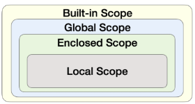

# 파이썬 기초 2 : 제어문 · 함수 · 모듈

- [제어문](#제어문)
  * [조건문(Conditional Statement)](#조건문(Conditional-Statement))
    + [복수 조건문](#복수-조건문)
    + [중첩 조건문](#중첩-조건문)
    + [조건 표현식(Conditional Expression)](#조건-표현식(Conditional-Expression))
  * [반복문](#반복문)
    + [while문](#while문)
    + [for문](#for문)
    + [반복문 제어](#반복문-제어)
- [함수](#함수)
    + [함수 기초](#함수-기초)
  * [함수의 결과값 (Output)](#함수의-결과값-(Output))
    + [값에 따른 함수의 종류](#값에-따른-함수의-종류)
  * [함수의 입력 (Input)](#함수의-입력-(Input))
    + [Positional Arguments](#**Positional-Arguments**)
    + [Keyword Arguments](#**Keyword-Arguments**)
    + [Default Arguments Values](#**Default-Arguments-Values**)
    + [정해지지 않은 여러 개의 Arguments 처리](#**정해지지-않은-여러-개의-Arguments-처리**)
  * [Python의 범위 (Scope)](#Python의-범위-(Scope))
    + [scope](#scope)
    + [variable](#variable)
    + [변수 수명주기(lifecycle)](#변수-수명주기(lifecycle))
    + [이름 검색 규칙(Name Resolution)](#이름-검색-규칙(Name-Resolution))
    + [global문](#global문)
    + [nonlocal](#nonlocal)
    + [함수의 범위 주의](#함수의-범위-주의)
  * [함수 응용](#함수-응용)
    + [map](#map)
    + [filter](#filter)
    + [zip](#zip)
    + [lambda](#lambda)
    + [재귀 함수(recursive function)](#재귀-함수(recursive-function))
- [모듈](#모듈)
  * [모듈과 패키지](#모듈과-패키지)
    + [파이썬 표준 라이브러리](#파이썬-표준-라이브러리)
    + [파이썬 패키지 관리자](#파이썬-패키지-관리자)
  * [사용자 모듈과 패키지](#사용자-모듈과-패키지)
    + [패키지 만들기](#패키지-만들기)
  * [가상환경](#가상환경)
    + [가상 환경 생성](#가상-환경-생성)


---
---


# 제어문

- 제어문은 순서도(flowchart)로 표현이 가능

---

## 조건문(Conditional Statement)

- 참/거짓에 대한 조건식이 사용
- 들여쓰기 주의 : 4space 사용

### 복수 조건문

```python
if 조건:
    # Code block
elif 조건:
    # Code block
elif 조건:
    # Code block
else:
    # Code block
```

### 중첩 조건문

```python
if 조건:
    # Code block
    if 조건:
        # Code block
else:
    # Code block
```

### 조건 표현식(Conditional Expression)

- 삼항 연산자(Ternary Operator)라고 부르기도 함
- `{true인 경우 값} if 조건 else {false인 경우 값}`

```python
# 절대값 나타내기
value = num if num >= 0 else -num

if num >= 0:
    value = num
else:
    value = -num
```

---

## 반복문

- 특정 조건을 만족할 때까지 같은 동작을 계속 반복하고 싶을 때 사용
- 파이썬 튜터 : 파이썬 실행 흐름을 보여줌
    
    [Python Tutor code visualizer: Visualize code in Python, JavaScript, C, C++, and Java](https://pythontutor.com/visualize.html#mode=edit)
    

### while문

- 종료 조건에 해당하는 코드를 통해 반복문을 종료
- 종료 조건이 중요할 때

- **조건식이 참인동안** 반복적으로 코드 실행

```python
while 조건:
    # Code block

```

- 무한루프 주의. 종료 조건이 반드시 필요!
- 복합 연산자 : 연산과 저장을 합쳐놓은 것

```python
a = 0
while a < 5:
    print(a)
    a += 1    # a = a + 1
print("끝")
```

### for문

- 시퀀스(string, tuple, list, range)를 포함한 순회 가능한 객체(iterable)의 요소를 모두 순회
- 횟수가 중요할 때

- Iterable
    - 순회할 수 있는 자료형(string, tuple, list, range, dict, set 등)
    - 순회형 함수(range, enumerate)
        
        ```python
        chars = "happy"
        
        for char in chars:
            print(char)
        ```
        h
        a
        p
        p
        y
        ```
        ```
        
    - 딕셔너리는 기본적으로 key를 순회
        
        ```python
        grades = {'john':80, 'eric':90}
        for student in grades:
            print(student)
        ```
        john
        eric
        ```
        ```
        
    - 추가 메서드
        - keys(), values(), items()

- enumerate()
    - 인덱스와 객체를 쌍으로 담은 열거형(enumerate) 객체 변환
    - (index, value) 형태의 tuple로 구성된 열거 객체를 반환
    
    ```python
    members = ['민수', '영희', '철수']
    
    for idx, number in enumerate(members):
        print(idx, number)
    
    print(list(enumerate(members, start=1)) # 숫자 1부터 시작.
    ```
    

- List Comprehension
    - `[{code} for 변수 in iterable if {조건식}]`

- Dictionary Comprehension
    - `{key: value for 변수 in iterable if {조건식}}`
    
- TIP : 변수를 사용하지 않으면 `_` 사용
    
    ```python
    for _ in range(3):
        print(random.choice(food_list))
    ```
    

### 반복문 제어

- `break`
    - 반복문을 종료
- `continue`
    - continue 이후 코드 블록은 수행하지 않고, 다음 반복을 수행
- `pass`
    - 아무것도 하지 않음
    - 문법적으로 필요하지만, 할 일이 없을 때 사용
- `for-else`
    - 끝까지 반복문을 실행한 이후에 else문 실행
    - break를 통해 중간에 종료되는 경우 else문은 실행되지 않음
        
        ```python
        for char in 'apple':
            if char == 'b':
                print('b!')
                break
        else:
            print('b'가 없습니다.')
        
        # b가 없습니다.
        
        for char in 'banana':
            if char == 'b':
                print('b!')
                break
        else:
            print('b'가 없습니다.')
        
        # b!
        # break로 중단되어서 else 구문은 실행되지 않는다.
        ```
        

---

---

# 함수

- 분해(Decomposition)
    - 기능 단위로 분해
    - 재사용 가능
- 추상화(Abstraction)
    - 복잡한 내용을 모르더라도 사용할 수 있도록

### 함수 기초

- 함수의 종류
    - 내장 함수
        - 파이썬에 기본적으로 포함된 함수
    - 외장 함수
        - import 문을 통해 사용하며, 외부 라이브러리에서 제공하는 함수
    - 사용자 정의 함수
        - 사용자가 직접 만드는 함수
- 함수의 정의
    - 특정한 기능을 하는 코드의 묶음
- 함수의 기본 구조
    - 선언과 호출(define & call) : 생성 & 사용
        - `def-function body-return`
        - `함수명(값1, 값2…)`
    - 입력(Input)
    - 문서화(Docstring)
    - 범위(Scope)
    - 결과값(Output)

---

## 함수의 결과값 (Output)

### 값에 따른 함수의 종류

- Void Function
    - 명시적인 return 값이 없는 경우, None을 반환하고 종료
    - ex) print : 값을 출력하지만, 값을 반환하지는 않음
- Value returning function
    - 함수 실행 후, return문을 통해 값 반환
    - return을 하게 되면, 값 반환 후 함수가 바로 종료
- print vs return
    - print를 사용하면 호출될 때마다 값이 출력 (주로 테스트에 사용)
    - 데이터 처리를 위해서는 return 사용
    - REPL(Read-Eval-Print-Loop) 환경(ex 주피터노트북)에서는 마지막 리턴 값을 보여주므로 착각할 수 있음.

```python
#Void Function

def void_product(x, y):
    print(f'{x+y}')

void_product(4, 5) # 9
ans = void_product(4, 5)
print(ans) # None

#Value returning function

def value_returning_product(x, y):
    reutrn x + y

value_returning_product(4, 5)
ans = value_returning_product(4, 5)
print(ans) # 20
```

---

## 함수의 입력 (Input)

- **Parameter** : 함수를 정의할 때, 함수 내부에서 사용되는 변수
    - def function(`ham`)
- **Argument** : 함수를 호출할 때, 넣어주는 값
    - function(`ham`)
    - 필수 : 반드시 전달되어야 함.
    - 선택 : 값이 전달되지 않아도 기본값이 전달

### **Positional Arguments**

- **기본적으로 함수 호출 시 Argument는 위치에 따라 함수 내에 전달됨**

### **Keyword Arguments**

- 직접 변수의 이름으로 특정 Argument를 전달할 수 있음
- Keyword Argument 다음에 Positional Argument를 활용할 수 없음. ⭐⭐⭐ 오는 순간 순서 체계 사라짐.

```python
def add(x, y):
    return x + y

add(x=2, y=5)
add(2, y=5)
add(x=2, 5) # Error
```

### **Default Arguments Values**

- 기본값을 지정

```python
def add(x, y=0):
    return x + y

add(2) # 2 + 0 = 2
```

### **정해지지 않은 여러 개의 Arguments 처리**

- `*`
    - 애스터리스크(Asterisk) 혹은 스퀀스 언패킹 연산자
    - 활용하여 가변인자를 만들 수 있음
- **가변인자** `*args`
    - 여러 개의 Positional Argument를 하나의 필수 parameter로 받아서 사용
- **패킹**
    - 여러개의 데이터를 묶어서 변수에 할당하는 것
- **언패킹**
    - 시퀀스 속의 요소들을 여러 개의 변수에 나누어 할당하는 것
    - 변수의 개수와 할당하고자 하는 요소의 갯수가 동일해야 함
    
    ```python
    numbers = (1, 2, 3, 4, 5) # 패킹
    a, b, c, d, e, f = numbers # 언패킹 : ValueError
    
    a, b, *rest = numbers
    print(a, b, rest) # 1 2 [3, 4, 5]
    
    a, *rest, e = numbers
    print(rest) # [2, 3, 4]
    ```
    

- **가변 키워드 인자(**kwargs)**
    - 몇 개의 키워드 인자를 받을지 모르는 함수를 정의할 때 유용
    - **kwargs는 딕셔너리로 묶여 처리되며, parameter에 **를 붙여 표현
    
    ```python
    
    def family(**kwargs):
        for key, value in kwargs.item():
            print(key, ':', value)
    
    family(father='아부지', mother='어머지', baby='아기')
    ```
    father : 아부지
    mother : 어머니
    baby : 아기
    ```
    ```
    

- 가변인자와 가변 키워드 인자를 함께 사용할 수 있음

---

## Python의 범위 (Scope)

- 함수는 코드 내부에 local scope를 생성하며, 그 외의 공간인 global scope로 구분

### scope

- **global scope**
    - 코드 어디에서든 참조할 수 있는 공간
- **local scope**
    - 함수가 만든 scope. 함수 내부에서만 참조 가능

### variable

- **global variable**
    - global scope에 정의된 변수
- **local variable**
    - local scope에 정의된 변수

### 변수 수명주기(lifecycle)

- **built-in-scope**
    - 파이썬이 실행된 이후부터 영원히 유지
- **global scope**
    - 모듈이 호출된 시점 이후 혹은 인터프리터가 끝날 때까지 유지
- **local scope**
    - 함수가 호출될 때 생성되고, 함수가 종료될 때까지 유지

### 이름 검색 규칙(Name Resolution)

- 파이썬에서 사용되는 이름(식별자)들은 **이름공간(namespace)**에 저장되어 있음
    
    
    
- **LEGB Rule**의 순서로 이름을 찾아나간다.
    - **L**ocal scope : 지역 범위(현재 작업 중인 범위)
    - **E**nclosed scope : 지역 범위 한 단계 위 범위
    - **G**lobal scope : 최상단에 위치한 범위
    - **B**uilt-in scope : 모든 것을 담고 있는 범위
    
    ```python
    print(sum) # built-in function
    print(sum(range(2))) # 1
    sum = 5
    print(sum) # 5
    print(sum(range(2))) # TypeError
    
    # Global의 sum 변수에 값 5가 할당
    # 이후 global에서 sum은 LEGB에 의해 5가 먼저 탐색
    # 삭제 : del 이용
    
    a = 0
    b = 1
    def enclosed():
        a = 10
        c = 3
        def local(c):
            print(a, b, c) # 10 1 300
        local(300)
        print(a, b, c) # 10 1 3
    enclosed()
    print(a, b) # 0 1
    ```
    
- **함수 내에서는 바깥 Scope의 변수에 접근 가능하나 수정은 할 수 없음**

### global문

- 현재 코드 블록 전체에 적용. 나열된 식별자가 global variable임을 나타냄
    - global에 나열된 이름은 같은 코드 블록에서 global 앞에 등장할 수 없음
    - global에 나열된 이름은 parameter, for 루프 대상, 클래스/함수 정의 등으로 정의되지 않아야 함

```python
a = 10
def func1():
    global a
    a = 3
print(a) # 10
func1()
print(a) # 3
```

### nonlocal

- global을 제외하고 가장 가까운 scope의 변수를 연결하도록 함
    - nonlocal에 나열된 이름은 같은 코드 블록에서 nonlocal 앞에 등장할 수 없음
    - nonlocal에 나열된 이름은 parameter, for 루프 대상, 클래스/함수 정의 등으로 정의되지 않아야 함
- global과는 달리 이미 존재하는 이름과의 연결만 가능

```python
x = 0
def func1():
    x = 1
    def func2():
        nonlocal a
        x = 2
    func2()
    print(x) # 2

func1()
print(x) # 0
```

### 함수의 범위 주의

- 기본적으로 함수에서 선언된 변수는 Local scope에 생성. 함수 종료시 사라짐.
- **함수 내에서 필요한 상위 scope 변수는 argument로 넘겨서 활용할 것** ⭐
- global과 nonlocal은 가급적 사용하지 않을 것

---

## 함수 응용

### map

- `map(function, iterable)` : map object
- **iterable에 function 적용한 값**을 map object로 반환
- 리스트 형변환으로 확인

### filter

- `filter(function, iterable)` : filter object
- **iterable에 function 적용해서 True인 값**을 filter object로 반환
- 리스트 형변환으로 확인

### zip

- `zip(*iterables)` : zip object
- 복수의 iterable을 모아 튜플을 원소로 하는 zip object로 반환
- 리스트를 세로로 묶음!

```python
girls = ['nana', 'jane']
boys = ['eric', 'jack']
pair = zip(girls, boys)
print(list(pair)) # [('nana', 'eric'), ('jane', 'jack')]
```

### lambda

- `lambda [parameter] : 표현식`
- 표현식을 계산한 결과값을 반환
- 이름이 없는 함수라 익명함수로 불림
- return문을 가질 수 없음
- 간편 조건문 외 조건문이나 반복문을 가질 수 없음

```python
triangle_area = lambda b, h : 0.5 * b * h
print(triangle_area(5, 6)) # 15.0
```

### 재귀 함수(recursive function)

- 자기 자신을 호출하는 함수
- 변수의 사용이 줄어들어 코드의 가독성이 높아짐
- 1개 이상의 base case(종료되는 상황)가 존재하고, 수렴하도록 작성

```python
def factorial(n):
    if n == 0 or n == 1:
        return 1
    else:
        return n * factorial(n-1)
print(factorial(4)) #24
```

- 메모리 스택이 넘치게 되면(stack overflow) 프로그램이 동작하지 않게 됨
- 최대 재귀 깊이 : 1000번. 이를 넘어가면 Recursion Error 발생

---

---

# 모듈

## 모듈과 패키지

- **모듈(module)** : 다양한 기능을 하나의 파일(.py)로
- **패키지(package)** : 다양한 파일을 하나의 폴더로
- **라이브러리(library)** : 다양한 패키지를 하나의 묶음으로
    - cf) 라이브러리 : 삽(비교적 자율적 도구) / 프레임워크 : 포크레인
- **pip** : 이것을 관리하는 관리자
- **가상환경** : 패키지의 활용 공간

- `import module`
- `from module import var, function, class`
- `from module import *` : 전부 다
- `from package import module`
- `from package.module import var, function, class`

### 파이썬 표준 라이브러리

- 파이썬에 기본적으로 설치된 모듈과 내장 함수
    
    [The Python Standard Library - Python 3.10.5 documentation](https://docs.python.org/ko/3/library/index.html)
    

### 파이썬 패키지 관리자

- 패키지 설치 및 삭제
    - `$ pip install SomePackage`
    - `$ pip install SomePackage==1.05`
    - `$ pip install SomePackage>=1.0.4`
    - `$ pip uninstall SomePackage`
    
- 패키지 목록 및 특정 패키지 정보
    - `$ pip list`
    - `$ pip show SomePackage`
    
- 설치한 라이브러리 목록을 저장 및 설치하기
    - `$ pip freeze > requirements.txt`
    - `$ pip install -r requirements.txt`

## 사용자 모듈과 패키지

### 패키지 만들기

- 폴더 구조

> my_package/
> 
> 
> > __init__.py
> > 
> > 
> > check.py
> > 
> > calculator/ 
> > 
> > > __init__.py
> > > 
> > > 
> > > tools.pt
> > > 
- tools에서 작성한 함수를 check에서 불러와서 쓸 수 있음.

---

## 가상환경

- 파이썬 표준 라이브러리가 아닌 외부 패키지와 모듈을 사용하는 경우 모두 pip를 통해 설치를 해야함
- 복수의 프로젝트의 버전이 상이한 경우
    - 과거 프로젝트 : django 버전 2.x
    - 신규 프로젝트 : django 버전 3.x
- 이러한 경우 가상환경을 만들어 프로젝트별로 독립적인 패키지를 관리 필요

- 특정 디렉토리에 가상 환경을 만들고, 고유한 파이썬 패키지 집합을 가질 수 있음
    - 특정 폴더에 가상 환경이 있고
    - 실행 환경(ex. bash)에서 가상환경을 활성화시켜
    - 해당 폴더에 있는 패키지를 관리/사용함

### 가상 환경 생성

- `$ python -m venv 가상환경이름`
- `$ source venv/Scripts/activate` : 이곳에서만 작동하는 파이썬 생성
- `$ deactivate` 가상환경 비활성화