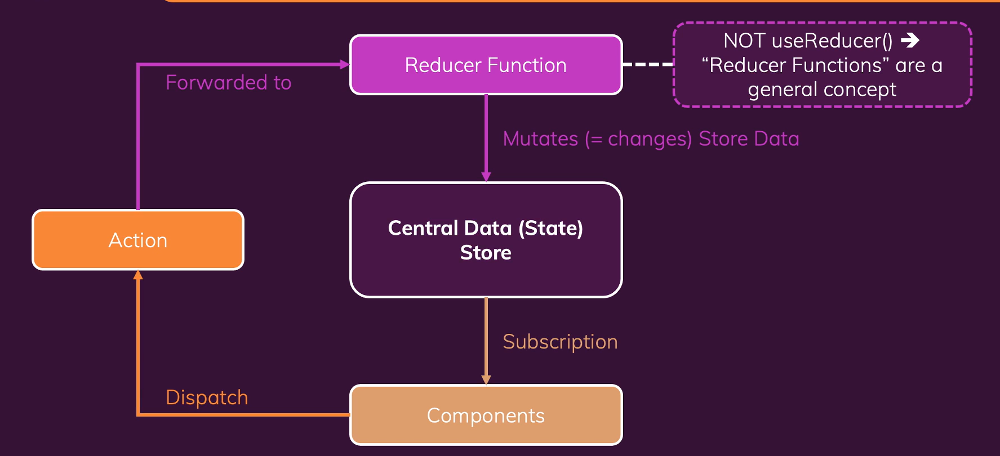

## 컴포넌트 간, 앱 전체의 상태관리 시스템

### `npm install redux`

### `npm install react-redux`

---

# State의 종류

## Local State

- 데이터가 변화할 때 단 하나의 컴포넌트에 영향을 미치는 상태
- `useState` / `useReducer`

## Cross-Component State

- 데이터가 변화할 때 여러개의 컴포넌트에 영향을 미치는 상태
- props chains, prop dilling 활용
- `useState` / `useReducer`
- Context, Redux

## App-Wide State

- 데이터가 변화할 때 애플리케이션의 모든 컴포넌트에 영향을 미치는 상태
- ex) 사용자 인정
- props chains, prop dilling 활용
- Context, Redux

---

# 리액트 컨텍스트의 단점 :

- 대형 애플리케이션의 경우 설정과 관리가 복잡해짐
  - 중첩된 ContextProvider
  - 복잡한 하나의 ContextProvider
- 데이터가 자주 바뀌는 경우에는 성능이 떨어짐

---

# 리덕스 작동 방식

중앙 데이터(상태) 저장소 → 컴포넌트에서 변화를 구독하고 활용. 직접 조작 XX Reducer Function으로 간접 조작.



---

## 절대 state를 바꾸면 안된다.

- 예기치 못한 속성 변화가 생길 수도 있다.
- Reducer의 return으로 새로운 값으로 덮어써야 한다.

```tsx
const initialState = { counter: 0, showCounter: true };
const counterReducer = (state = initialState, action) => {
  if (action.type === "increment") {
    return {
      counter: state.counter + 1,
      showCounter: state.showCounter,
    };
  }
  if (action.type === "increase") {
    return {
      counter: state.counter + action.amount,
      showCounter: state.showCounter,
    };
  }
  if (action.type === "decrement") {
    return {
      counter: state.counter - 1,
      showCounter: state.showCounter,
    };
  }

  if (action.type === "toggle") {
    return {
      counter: state.counter,
      showCounter: !state.showCounter,
    };
  }

  return state;
};
```

---

# Redux toolkit

`npm install @reduxjs/toolkit`

`npm install react-redux`

이후 package.json에서 redux를 지워야 한다. (toolkit에 포함되어 있음)

- Redux를 더 쉽게 사용할 수 있도록 도와주는 라이브러리

```tsx
import { createSlice, configureStore } from "@reduxjs/toolkit";

const initialCounterState = { counter: 0, showCounter: true };
const counterSlice = createSlice({
  name: "counter",
  initialState: initialCounterState,
  reducers: {
    increment(state) {
      state.counter++;
    }, // redux toolkit: 자동으로 새로운 객체 생성 후 오버라이드
    decrement(state) {
      state.counter--;
    },
    increase(state, action) {
      state.counter = state.counter + action.payload;
    },
    toggleCounter(state) {
      state.showCounter = !state.showCounter;
    },
  },
});
```
