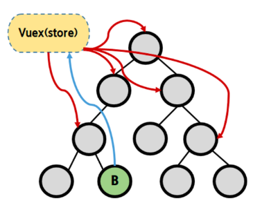
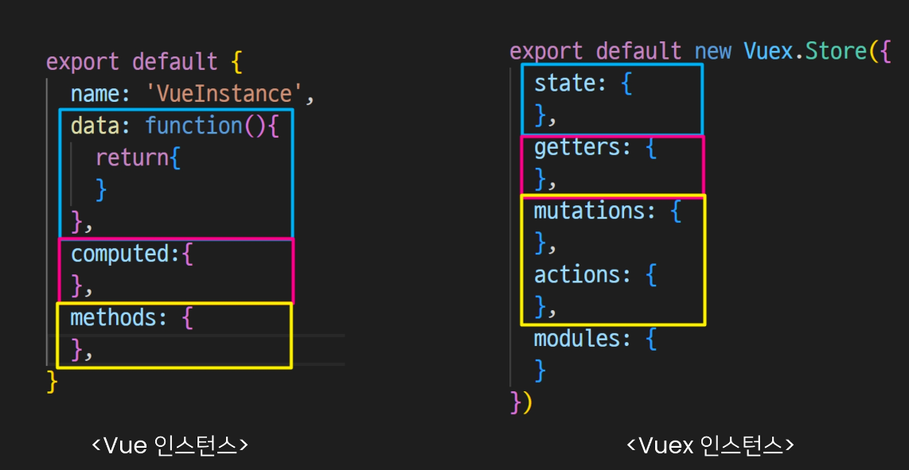
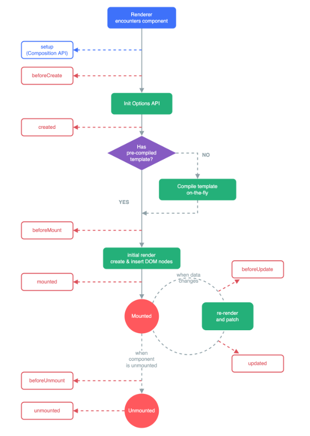

# State Management

- 상태State : 현재에 대한 정보data
- App이 가지고 있는 Data로 표현
- 여러개의 component를 조합하여 하나의 App을 만듬
    - 여러개의 component가 같은 상태를 유지 필요



## Centralized Store

- 중앙 저장소에 데이터를 모아서 상태 관리
- 각 component는 중앙 저장소의 데이터를 사용
- component의 계층에 상관없이 중앙 저장소에 접근해서 데이터를 얻거나 변경 가능
- 중앙 저장소의 데이터가 변경되면 각각의 component는 해당 데이터의 변화에 반응하여 새로 변경된 데이터를 반영
- 규모가 크거나 컴포넌트 중첩이 깊은 프로젝트의 관리가 매우 편리

## Vuex

- state management pattern + Library for vue.js
    - 상태관리 패턴 + 라이브러리
- 중앙 저장소를 통해 상태 관리를 할 수 있도록 하는 라이브러리
- 데이터가 예측 가능한 방식으로만 변경될 수 있도록 규칙 설정
- Vue의 반응성을 효율적으로 사용하는 상태 관리 기능을 제공
<<<<<<< HEAD

---

# Vuex 시작하기

```jsx
vue create vuew-app

cd vuex-app

vue add vuex  // vue CLI를 통해 vuex plugin 적용
```

- src / store / index.js 생성
- vuex의 핵심 컨셉
    1. state
    2. getters
    3. mutations
    4. actions



## 1. State

### 중앙에서 관리하는 모든 상태 정보

- vue 인스턴스의 data에 해당
- 개별 component는 state에서 데이터를 가져와서 사용
    - 개별 component가 관리하던 data를 중앙 저장소(Vuex store state)에서 관리
- state의 데이터가 변화하면 해당 데이터를 사용하는 component도 자동으로 다시 랜더링
- `$store.state` 로 state 데이터에 접근

## 2. Mutations

### state를 변경하기 위한 methods

- vue 인스턴스의 methods에 해당하지만 Mutations에서 호출되는 핸들러handler 함수는 반드시 동기적이어야 함
    - 비동기 로직으로 mutations를 사용해서 state를 변경하는 경우, state의 변화의 시기를 특정할 수 없기 때문
- 첫번째 인자로 `state`를 받으며, component 혹은 Actions에서 `commit()` 메서드로 호출됨

<aside>
💡 handler 함수

- mutation, action에서 호출되는 함수
</aside>

## 3. Actions

### 비동기 작업이 포함될 수 있는 methods

- state를 직접 변경하지 않고 `commit()` 메서드로 mutations를 호출해서 state를 변경
- `context` 객체를 인자로 받으며, 이 객체를 통해 store.js의 모든 요소와 메서드에 접근 가능
    - context:전체 객체
- component에서 `dispatch()` 메서드에 의해 호출

### `dispatch({호출하고자 하는 actions 함수}, {넘겨주는 데이터})`

### Mutations & Actions

- vue component의 methods 역할이 vuex에서는 분화
- Mutations
    - state를 변경
- Actions
    - 나머지 로직

## 4. Getters

### state를 활용해 계산한 새로운 변수 값

- vue 인스턴스의 computed에 해당
- state를 활용하여 계산된 값을 얻고자 할 때 사용
    - state의 원본 데이터를 건들지 않고 계산된 값을 얻을 수 있음
- computed와 마찬가지로 getters의 결과는 캐시cache되며, 종속된 값이 변경된 경우에만 재계산
- getters에서 계산된 값은  state에 영향을 미치지 않음
- 첫번째 인자로 state, 두번째 인자로 getter를 받음

---

# Vuex 실습

## Component에서 데이터를 조작하기 위한 데이터 흐름

### `Component` → `(actions)` → `mutations` → `state`

- Actions

```jsx
// index.js
import Vue from 'vue'
import Vuex from 'vuex'

Vue.use(Vuex)

export default new Vuex.Store({
  state: {
    message: 'message in store',                    // 1. Component
  },
  mutations: {
    CHANGE_MESSAGE(state, newMessage) {             // 3. mutations
      state.message = newMessage                    // 4. state
    }
  },
  actions: {                                        // 2. actions
    changeMessage(context, newMessage) {
      context.commit('CHANGE_MESSAGE', newMessage)  // 3. mutations
    }
  },
  modules: {
  }
})
```

```html
// App.vue
<template>
  <div id="app">
    <h1>{{ message }}</h1>                               // 1. Component
    <input
      type="text"
      @keyup.enter="changeMessage"
      v-model="inputData"
    >
  </div>
</template>

<script>
export default {
  name: 'App',
  data() {
    return {
      inputData: null,
    }
  },
  computed: {
    message() {                                           // 1. Component
      return this.$store.state.message
    },
  },
  methods: {
    changeMessage() {                                     // 2. actions
      const newMessage = this.inputData
      this.$store.dispatch('changeMessage', newMessage)
    }
  }
}
</script>

```

## Component에서 데이터를 사용하기 위한 데이터 흐름

### `state` → `(getters)` → `component`

```jsx
// index.js
import Vue from 'vue'
import Vuex from 'vuex'

Vue.use(Vuex)

export default new Vuex.Store({
  state: {                                     // 1. state
    message: 'message in store',                 
  },
  getters: {
    messageLength(state) {                     // 2. getters
      return state.message.length
    },
    doubleLength(state, getters) {
      return getters.messageLength * 2         // 2. getters
    }
  },
  mutations: {
    CHANGE_MESSAGE(state, newMessage) {           
      state.message = newMessage
    }
  },
  actions: {                                    
    changeMessage(context, newMessage) {
      context.commit('CHANGE_MESSAGE', newMessage) 
    }
  },
  modules: {
  }
})
```

```html
// App.vue
<template>
  <div id="app">
    <h1>{{ message }}</h1>                    
    <h2>입력된 문자의 길이는 {{ messageLength }}</h2>   // 3. Components
    <h2>두배하면 {{ doubleLength }}</h2>               // 3. Components
    <input
      type="text"
      @keyup.enter="changeMessage"
      v-model="inputData"
    >
  </div>
</template>

<script>
export default {
  name: 'App',
  data() {
    return {
      inputData: null,

    }
  },
  components: {
  },
  computed: {
    message() {                                        
      return this.$store.state.message
    },
    messageLength() {                                   
      return this.$store.getters.messageLength        // 3. Components
    },
    doubleLength() {
      return this.$store.getters.doubleLength         // 3. Components
    } 
  },
  methods: {
    changeMessage() {                      
      const newMessage = this.inputData
      this.$store.dispatch('changeMessage', newMessage)
    }
  }
}
</script>

```

---

# Lifecycle Hooks

- 각 Vue 인스턴스는 생성과 소멸의 과정 중 단계별 초기화 과정을 거침
    - Vue 인스턴스가 생성된 경우, 인스턴스를 DOM에 마운트하는 경우, 데이터가 변경되어 DOM를 업데이트하는 경우 등
- 각 단계가 트리거가 되어 특정 로직을 실행할 수 있음
- 이를 Lifecycle Hooks라고 함



## created

- Vue instance가 생성된 후 호출
- data, computed 등의 설정이 완료된 상태
- 서버에서 받은 데이터를 vue instance의 data에 할당하는 로직을 구현하기 적합
- 단, mount 되지 않아 요소에 접근할 수 없음

## mounted

- Vue instance가 요소에 mount된 후 호출됨
- mount된 요소를 조작할 수 있음
- created의 경우, mount 되기 전이기 때문에 DOM에 접근할 수 없으므로 동작하지 않음
- mounted는 주석 처리

## updated

- 데이터가 변경되어 DOM에 변화를 줄 때 호출됨

## Lifecycle Hooks의 특징

- instance마다 각각의 Lifecycle을 가지고 있음
- Lifecycle Hooks는 컴포넌트별로 정의할 수 있음
    - App.vue 생성 → ChildComponent 생성 → ChildComponent 부착 → App.vue 부착 → ChildComponent 업데이트
- 부착 여부가 부모-자식 관계에 따라 순서를 가지고 있지 않음
    - 부모 컴포넌트의 mounted hook이 실행되었다고 해서 자식이 mount 된 것이 아니고,
    - 부모 컴포넌트의 updated hook이 실행되었다고 해서 자식이 updated 된 것이 아님
    - → instance마다 각각의 Lifecycle을 가지고 있기 때문
