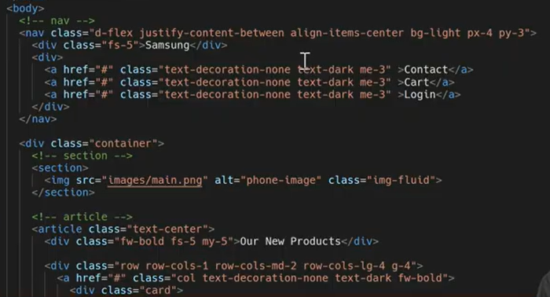

- [**CSS Layout**](#CSS-Layout)
  * [Float](#Float)
  * [Flexbox](#Flexbox)
    + [CSS Flexible Box Layout](#CSS-Flexible-Box-Layout)
    + [Flex 배치 설정](#Flex-배치-설정)
    + [Flex 공간 나누기](#Flex-공간-나누기)
    + [Flex 정렬](#Flex-정렬)
    + [Flex 기타 속성](#Flex-기타-속성)
- [**bootstrap**](#bootstrap)
    + [spacing](#spacing)
  * [Bootstrap Grid System](#Bootstrap-Grid-System)


# CSS Layout

## Float

- 인라인 요소들이 박스 주변을 wrapping 하도록 함
- 요소가 Normal Flow를 벗어나도록 함
- 속성
    - none, left, right

---

## Flexbox

### CSS Flexible Box Layout

- 행과 열 형태로 아이템을 배치하는 1차원 레이아웃 모델
- 축
    - main axis 메인 축
    - cross axis 교차 축
- 구성 요소
    - **Flex Container** 부모 요소
        - `display: flex` `display: inline-flex` 적용
        - flexbox 레이아웃을 형성하는 기본 모델
    - **Flex Item** 자식요소
        - 컨테이너에 속해 있는 컨텐츠(박스)

<br>

### Flex 배치 설정

- **flex-direction**
    - row, row-reverse, column, column-reverse
- **flex-wrap**
    - wrap (여러줄), nowrap (한 줄)
- **flex-flow**
    - flex-direction + flex-wrap

<br>

### Flex 공간 나누기

- **justify-content**
    - main-axis를 기준으로 공간 배분
- **align-content**
    - cross-axis를 기준으로 공간 배분
- 속성
    - flex-start, flex-end, center
    - space-between : 간격 균일
    - space-around : 영역 균일
    - space-evenly : 전체 영역에서의 간격 균일

<br>

### Flex 정렬

- **align-items**
    - 모든 아이템을 cross axis 기준으로 정렬
- **align-self**
    - 개별 아이템을 cross axis 기준으로 정렬
- 속성
    - stretch : (기본) 영역에 맞춰 늘어남
    - flex-start, flex-end, center
    - baseline : 텍스트 baseline에 기준선을 맞춤

<br>

### Flex 기타 속성

- flex-grow : 남은 영역을 해당 아이템에 분배 `grow-1`
- order : 배치 순서 n만큼 변경 `order-1`

---

# bootstrap

- CDN
    - 컨텐츠를 효율적으로 전달하기 위해 여러 노드에 가진 네트워크에 데이터를 제공하는 시스템.

```html
  <link href="https://cdn.jsdelivr.net/npm/bootstrap@5.2.0/dist/css/bootstrap.min.css" rel="stylesheet" integrity="sha384-gH2yIJqKdNHPEq0n4Mqa/HGKIhSkIHeL5AyhkYV8i59U5AR6csBvApHHNl/vI1Bx" crossorigin="anonymous">
</head>

...

  <script src="https://cdn.jsdelivr.net/npm/bootstrap@5.2.0/dist/js/bootstrap.bundle.min.js" integrity="sha384-A3rJD856KowSb7dwlZdYEkO39Gagi7vIsF0jrRAoQmDKKtQBHUuLZ9AsSv4jD4Xa" crossorigin="anonymous"></script>   
</body>
```

<br>

### spacing

`{property}{sides}-{size}`

* **property**

  | name | property |
  | --- | --- |
  | `m` | margin |
  | `p` | padding |

* **sides**

  | name | sides |
  | --- | --- |
  | `t` | top |
  | `b` | bottom |
  | `s` | -left |
  | `e` | -right |
  | `x` | -left & -right |
  | `y` | -top & -bottom |
  | blank | all 4 sides |

* **size**

  | size | rem, px |
  | --- | --- |
  | `0` | 0rem, 0px |
  | `1` | 0.25rem, 4px |
  | `2` | 0.5rem, 8px |
  | `3` | 1rem, 16px |
  | `4` | 1.5rem, 24px |
  | `5` | 3rem, 48px |
  | `auto` | center |
- `.mx-auto` 수평 중앙 정렬

<br>

### Components

- Buttons, Dropdowns, Forms. Navbar, Carousel, Modal, Card
    
    [Bootstrap](https://getbootstrap.com/)
    
- 모달은 항상 TOP level! (html과 같은 레벨)

<br>

### Responsive web Design

- 반응형 웹은 별도의 기술이 아닌 웹 디자인에 대한 접근 방식

---

## Bootstrap Grid System

- flexbox로 제작
- **container, row, column으로 컨텐츠를 배치하고 정렬** ⭐⭐⭐
    - Container : Column들을 담고 있는 공간
    - Row : Container 안의 한 행
    - Column : 실제 컨텐츠를 포함하는 부분
    - Gutter : 칼럼과 칼럼 사이의 공간 (사이 간격)
* **12개의 column** ⭐⭐⭐
* **6개의 grid breakpoints** ⭐⭐⭐

- `.col-{break point}-{num}` : 너비 설정
- `.offset-{break pont}-{num}` : 앞 여백 설정
- `.img-fluid` : 이미지 크기 조절

