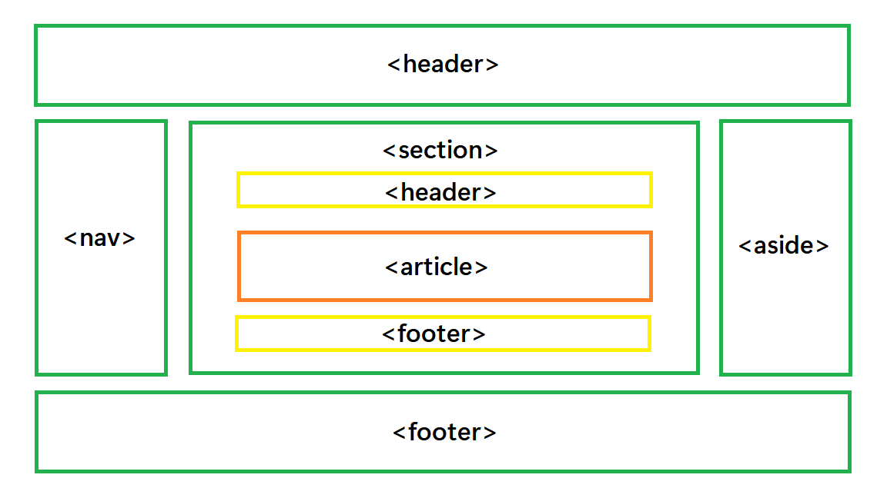

# Web

### 웹 사이트의 구성 요소

- **웹사이트** : **브라우저**를 통해서 접속하는 웹 페이즈들의 모음
- **웹페이지** : 글, 그림, 동영상 등 여러가지 정보를 담고 있는 페이지

- **HTML** → 구조 (건물)
- **CSS** → 표현 (인테리어)
- **Javascript** → 동작 (엘리베이터)

<br>

### 웹 표준과 크로스 브라우징

- **웹 표준** : 웹에서 표준적으로 사용되는 기술이나 규칙
- **크로스 브라우징** : 어떤 브라우저든 웹 페이지가 동일하게 보이도록 함

- 브라우저별 호환성 체크 사이트
    
    [Can I use... Support tables for HTML5, CSS3, etc](https://caniuse.com/)
    
<br>

### 개발 환경 설정

- Visual Studio Code
    - Open in browser, Auto rename tag, Highlight Matching Tag, Live server
- 크롬 개발자 도구 (F12)
    - Elements : 해당 요소의 HTML 태그. DOM 탐색 및 CSS 확인 및 변경
        - **Styles** : 요소에 적용된 CSS 확인
        - **Computed** : 스타일이 계산된 최종 CSS
        - Event Listeners : 해당 요소에 적용된 이벤트 (JS)
        

---

# HTML

→ **웹 페이지**를 **구조화**하기 위한 언어 (.html)

- **Hyper Text**
    - **참조**(하이퍼링크)를 통해 사용자가 한 문서에서 다른 문서로 즉시 접근할 수 있는 **텍스트**
- **Markup Language**
    - **태그** 등을 이용하여 문서나 데이터의 **구조**를 명시하는 **언어**

<aside>
📎 마크업 스타일 가이드 : **2 space**

</aside>

## HTML 기본구조

```html
<!DOCTYPE html>
<html lang="en">             <!--html : 문서의 최상위(root) 요소-->
<head>                       <!--head : 문서의 메타데이터 요소-->
  <meta charset="UTF-8">       <!--문서 제목, 인코딩, 스타일, 외부 파일 로딩 등-->
  <title>Document</title>      <!--일반적으로 브라우저에 나타나지 않는 내용-->
</head>
<body>                       <!--body : 문서 본문 요소-->
                               <!--실제 화면 구성과 관련된 내용-->
</body>
</html>
```
<br>

### head

```html
<head>                                    <!--head : 문서의 메타데이터 요소-->
  <meta charset="UTF-8">                    <!--meta : 문서 레벨 메타데이터 요소-->
  <title>HTML 수업</title>                  <!--title : 브라우저 상단 타이틀-->
  <link href="style.css" rel="stylesheet">  <!--link : 외부 리소스 연결 요소-->
  <script src="javascript.js"></script>     <!--script : 스크립트 요소-->
  <style>                                   <!--style : CSS 직접 작성-->
    p {
      color: black;
    }
  </style>
</head>
```

- Open Graph Protocol
    - 메타 데이터를 표현하는 새로운 규약
    - 메타 데이터를 통해 문서의 정보(제목, 설명, 썸네일 등)를 전달
    - 메타 데이터 : 데이터에 대한 간단한 데이터

<br>

### 요소 element

- `<tag>contents</tag>` 태그 + 내용
- 태그를 통해 **그 정보의 성격과 의미를 정의**
- 내용이 없는 태그들도 존재 (닫는 태그가 없음)
    - br, hr, img, input, link, meta
- 요소는 **중첩**nested될 수 있음
    - 중첩을 통해 하나의 문서를 **구조화**
    
    <aside>
    📎 태그의 쌍을 잘 확인해야 함!
    
    </aside>
    
<br>

### 속성 attribute

- `<a 속성명="속성값"></a>`
- 태그의 부가적인 정보를 설정
- 태그별로 사용할 수 있는 속성은 다르다
- 요소의 시작태그에 작성. 보통 이름과 값이 하나의 쌍으로 존재

<aside>
📎 속성 지정 스타일 가이드 : 공백 XXX, “쌍따옴표 사용”

</aside>

- **HTML Global Attribute** : 모든 HTML 요소가 사용 가능
    
    
    | 속성 | 내용 |
    | --- | --- |
    | id | (한 개) 문서 전체에서 유일한 고유 식별자 지정 |
    | class | (여러개) 공백으로 구분된 해당 요소의 클래스의 목록 (CSS, JS에서 요소를 선택/접근) |
    | data-* | 페이지에 개인 사용자 정의 데이터를 저장하기 위해 사용 |
    | style | inline 스타일 |
    | title | 요소에 대한 추가 정보 지정 |
    | tabindex | 요소의 탭 순서 (UX 개선) |

<br>

### 시맨틱 태그



- HTML 태그가 특정 목적, 역할 및 의미적 가치(semantic value)를 가지는 것
- ex) a, form, table ↔ Non semantic 요소 : div, span
    
    
    | 태그 | 내용 |
    | --- | --- |
    | header | 문서 전체나 섹션의 헤더(머리말 부분) |
    | nav | 내비게이션 |
    | aside | 사이드에 위치한 공간. 메인 콘텐츠와 관련성이 적은 콘텐츠. |
    | section | 문서의 일반적인 구분, 컨텐츠의 그룹을 표현 |
    | article | 문서, 페이지, 사이트 안에서 독립적으로 구분되는 영역 |
    | footer | 문서 전체나 섹션의 푸터(마지막 부분) |
- **의미론적 마크업을 위해**
    - 개발자, 사용자, 검색엔진 최적화(SEO)
    - 요소의 의미가 명확. 코드의 가독성을 높이고 유지보수를 쉽게 함.

<br>

### 렌더링

- 웹사이트 코드를 사용자가 보게 되는 웹 사이트로 바꾸는 과정 (브라우저가 수행)

<br>

### DOM(Document Object Model) 트리


- 텍스트 파일인 HTML 문서를 브라우저에서 렌더링하기 위한 구조
- HTML 문서에 대한 모델 구성
- HTML 문서 내의 각 요소에 접근 / 수정에 필요한 프로퍼티와 메서드 제공

## HTML 문서 구조화

### 인라인 / 블록 요소

- 인라인 : 글자처럼 취급
- 블록 : 한 줄 모두 사용

<br>

### 텍스트 요소

| 태그 | 설명 |
| --- | --- |
| `<a></a>` | 앵커 태그. href 속성을 활용하여 하이퍼링크 생성 |
| `<b></b>` | 굵은 글씨 요소 |
| `<strong></strong>` |  |
| `<i></i>` | 기울임 글씨 요소 |
| `<em></em>` |  |
| `<br>` | 텍스트 내에 줄 바꿈 생성 |
| `` | src 속성을 활용하여 이미지 표현 |
| `<span></span>` | 의미 없는 인라인 컨테이너 |

<br>

### 그룹 컨텐츠

| 태그 | 설명 |
| --- | --- |
| `<p></p>` | 하나의 문단 (paragraph) |
| `<hr>` | 수평선 (주제의 분리) |
| `<ol></ol>` | 순서가 있는 리스트 (ordered) |
| `<ul></ul>` | 순서가 없는 리스트 (unordered) |
| `<pre></pre>` | HTML에 작성한 내용을 그대로 표현 (보통 고정폭 글꼴, 공백문자 유지) |
| `<blockquote></blockquote>` | 텍스트가 긴 인용문 (보통 들여쓰기로 표현) |
| `<div></div>` | 의미 없는 블록 레벨 컨테이너 |

<br>

### form ⭐

- 정보(데이터)를 **서버에 제출**하기 위해 사용하는 태그 (ex. 로그인)
- 기본 속성
    - `action` : form을 처리할 서버의 URL (데이터를 보낼 곳) ⭐
    - `method` : form을 제출할 때 사용할 HTTP 메서드 (GET 받기 or POST 변경) ⭐
    - enctype : method가 post인 경우 데이터의 유형
        - 기본값 : application/x-www-form-urlencoded
        - 파일 전송시(input type : file) : multipart/form-data

```html
<form action="https://www.google.com/search" method="GET">
  <input type="text" name="q">
</form>

<!--https://www.google.com/search?q=HTML-->
<!--Get 방식에서는 쿼리가 그대로 드러남-->
```

<br>

### input

- 다양한 타입을 가지는 입력 데이터 유형과 위젯 제공
- 기본 속성
    - `name` : form control에 적용되는 이름. 서버로 보낼 이름. (이름/값 페어)
    - `value` : form control에 적용되는 값 (이름/값 페어)
    - required(필수입력), readonly, autofocus(첫 커서), autocomplete, disabled(사용하지 않음)

- **input label**
    - label 클릭 → input에 커서
        
        ```html
          <label for="agreement">개인정보 수집에 동의합니다.</label>
          <input type="checkbox" name="agreement" id="agreement">
        ```
        

- 유형 - 일반
    - HTML 기본 검증(유효성 검사) : 적절한 데이터 포맷인지 확인
    
    |  유형(type) | 내용 |
    | --- | --- |
    | text | 일반 텍스트 입력 |
    | password | 입력값을 *로 표현 |
    | email | 이메일 형식만 제출 가능 |
    | number | min, max, stop 속성을 활용하여 수사 범위 설정 가능 |
    | file | accept 속성을 활용하여 파일 타입 지정 가능 |
- 유형 - 항목 중 선택
    - label 태그와 함께 이용. 동일 항목에 대해서는 name 지정, 선택 항목에는 value 지정
    
    ```html
    <input id="html" type="checkbox" name="language" value="html">
    <label for="html">HTML</label>
    <input id="python" type="checkbox" name="language" value="python">
    <label for="python">파이썬</label>
    <input id="java" type="checkbox" name="language" value="java">
    <label for="java">자바</label>
    ```
    
    |  유형(type) | 내용 |
    | --- | --- |
    | checkbox | 다중 선택 |
    | radio | 단일 선택 |
- 유형 - 기타
    
    
    |  유형(type) | 내용 |
    | --- | --- |
    | color | color picker |
    | date | date picker |
    | hidden | 사용자에게 보이지 않는 input |
- 유형 찾아보기
    - search : mdn + type keyword
        
        [: 입력 요소 - HTML: Hypertext Markup Language | MDN](https://developer.mozilla.org/ko/docs/Web/HTML/Element/Input)
        

---

# CSS

Cascading(계단식) Style Sheets

별명을 통해 **선택하고 스타일을 지정**한다

```css
선택자Selector{
  선언Declaration(속성Property: 값Value;)
}
```

<br>

### **CSS 정의 방법**

- **인라인** inline : 태그에 직접 style 속성 적용
    
    `<h1 style=”color: blue”>Hello</h1>`
    
- **내부참조** embedding : <style>
    
    ```html
    <style>
      h1{
      color: blue;
      }
    </style>
    ```
    
- **외부참조** link file : 분리된 CSS 파일 ⭐
    
    ```html
    <head>
    	<link rel="stylesheet" href="mystyle.css">
    </head>
    ```
    
    ```css
    /* my style.css */
    
    h1{
      color: blue;
    }
    ```
    

---

## CSS 선택자Selectors

### 유형

- 기본 선택자 ⭐⭐
    - 전체 선택자  `*`, 요소 선택자 (HTML tag) `h2`
    - 클래스 선택자 `.class`, 아이디 선택자 `#id`, 속성 선택자 `button[type="submit"]`
- 결합자 ⭐
    - 자손 결합자 `A B` : selectorA **하위의 모든** selectorB 요소
    - 자식 결합자 `A > B` : selectorA **바로 아래의** selectorB 요소
    - 일반 형제 결합자 `A ~ B` : selectorA의 **형제 중 뒤에** 위치한 모든 selectorB 요소
    - 인접 형제 결합자 `A + B` : selectorA의 **형제 중 바로 뒤에** 위치한 selectorB 요소
- 의사 클래스/요소
    - 링크, 동적 의사 클래스
    - 구조적 의사 클래스, 기타 의사 클래스, 의사 엘리먼트, 속성 선택자

> 요소 : 서울 사람
> 
> 
> .클래스 : 서울사람 중 최씨, 김씨
> 
> #아이디 : 지용, 길동
> 
> 손병호 게임 : 김씨 접어!
> 

<br>

### css 적용 우선순위 cascading order ⭐⭐⭐

<aside>
🤖 범위가 좁을수록 강하다. 같은 범위라면 밑에 있는 애가 강하다.

</aside>

1. 중요도 Importance
    - `!important`
2. 우선 순위 Specificity
    - 인라인 > id > class, 속성, pseudo-class > 요소, pseudo-element
3. CSS 파일 로딩 순서

<br>

### CSS 상속

CSS는 상속을 통해 부모 요소의 속성을 자식에게 자동으로 상속한다.

- 되는 거 : Text 관련 요소, opacity, visibility 등
- 안 되는 거 : 레이아웃, 여백 관련. border 등

---

## CSS 기본 스타일

### CSS 크기 단위

- **px**
    - 모니터 해상도의 한 화소
    - 픽셀의 크기는 변하지 않는다. 고정 단위. (눈에 보이는 건 다를 수 있음)
- **%**
    - 백분율 단위
    - 가변 레이아웃에서 사용
- **em**
    - 부모 요소에 대한 상속의 영향을 받음
    - 지정된 요소에 대한 배수 단위
- **rem**
    - 부모 요소에 대한 상속의 영향을 받지 않음
    - 최상위 요소(html)에 대한 배수 단위

<br>

### 크기 단위 viewport

- 웹 페이지를 방문한 유저에게 바로 보이게 되는 웹 컨텐츠의 영역 (디바이스 화면)
- 디바이스의 viewport를 기준으로 상대적인 사이즈 결정
- vw, vh, vmin, vmax (화면의 % 단위)

<br>

### 색상 단위

- 색상 키워드
    - `background-color: red;`
- RGB 색상
    - `background-color: rgba(0, 255, 0, 0.5);`
    - `background-color: #rrggbb;`
- HSL 색상
    - 색상, 채도, 명도

<br>

### CSS 문서 표현

- 텍스트
    - 서체(font-family), 서체스타일, 자간, 단어 간격, 행간
- 컬러(color), 배경(background-color, background-image)
- 목록(li), 표(table)

---

## CSS Box model

⭐ **모든 요소는 네모이고, 위에서부터 아래로, 왼쪽에서 오른쪽으로 쌓인다.** ⭐ Normal Flow

<br>

### **Box model 구성** ⭐⭐⭐

- **margin** : 테두리 바깥의 외부 여백 (배경색 지정 X) ⭐⭐⭐

```css
.margin {
  margin-top: 10px
  margin-right: 20px
  margin-bottom: 30px
  margin-left: 40px
}

/* margin shorthand */ 

.margin-1 {
  margin: 10px;    /* 상하좌우 */
}

.margin-2 {
  margin: 10px 20px;    /* 상하 좌우 */
}

.margin-3 {
  margin: 10px 20px 30px;    /* 상 좌우 하 */
}

.margin-4 {
  margin: 10px 20px 30px 40px;    /* 상 우 하 좌 */
}
```

- **border** : 테두리 영역

```css
.border {
  border-width: 2px;
  border-style: dashed;
  border-color: black;
}

/* border shorthand */ 

.border{
  border: 2px dashed black;
}
```

- **padding** : 테두리 안쪽의 내부 여백

```css
.margin-padding{
  margin: 10px;
  padding: 30px;
}
```

- **content** : 글이나 이미지 등 요소의 실제 내용

<br>

### box-sizing

- 기본적으로 모든 요소의 box-sizing은 **content-box**
    - padding을 제외한 순수 contents 영역만을 box로 지정
- border까지의 너비를 100px로 → box-sizing을 **border-box**로 설정

---

## CSS Display

⭐ **display에 따라 크기와 배치가 달라진다.** ⭐

- **블록**
    - 줄 바꿈이 일어나는 요소
    - 화면 크기 전체의 가로 폭 차지
    - `display: block`
    - **div**, ul, ol, li, **p,** hr, form

- **인라인**
    - 글자처럼 취급. 기본 너비는 컨텐츠 영역만큼
    - width, height, margin-top, margin-bottom 지정 불가
    - line-height : 상하여백
    - `display: inline`
    - **span**, a, img, input, label, b, em, i, strong

- **display**
    - `display: inline-block` : block을 인라인처럼 사용. (한줄에 표시 + width, height, margin)
    - `display: none` : 화면 표시 x 공간 부여 x ⭐
    - `visibility: hidden` 화면 표시 x 공간 부여 o ⭐

<br>

### 수평 정렬

| margin-align | text-align |
| --- | --- |
| 해당 요소에 정의 | 부모 요소에 정의 |
| 모든 요소 가능 | 블럭 Only |
| `margin-right: auto;` | `text-align: left;` |
| `margin-left: auto;` | `text-align: right;` |
| `margin-right: auto; margin-left: auto;` | `text-align: right;` |

---

## CSS Position

문서 상에서 요소의 위치를 지정

⭐ **position으로 위치의 기준을 변경** ⭐

- **static**
    - 모든 태그의 기본 값 (기준 위치)
    - Normal Flow 유지
    - 부모 요소 내에서 배치될 때는 부모 요소의 위치를 기준으로 배치

1. **relative** 상대 위치
    - static 위치를 기준으로 이동
    - static 위치 차지 o  / Normal Flow 유지
2. **absolute** 절대 위치
    - static이 아닌 부모 요소 (없으면 브라우저 화면) 기준으로 이동
    - static 위치 차지 x  / Normal Flow 이탈
    - z index로 겹친 요소 중 어떤 게 앞에 올지 결정
3. **fixed** 고정 위치
    - 부모 요소와 관계 없이 viewport 기준으로 이동
    - static 위치 차지 x / Normal Flow 이탈
    - **스크롤 해도 위치 유지**
4. **sticky**
    - 기본 static. 스크롤에 따라 fixed로 변경
    - static 위치차지 o
    - **스크롤 해도 위치 유지**

---

## Emmet

[Cheat Sheet](https://docs.emmet.io/cheat-sheet/)

- `lorem + Tab` : 아무 글자나 나오기
- `! + Tab` : 자동완성
- `<p>*n + Tab` : 요소 n개 생성
- `div>div*n + Tab` : 요소 안에 요소 n개 생성
- `nav>l>li + Tab` : 자식 요소 생성