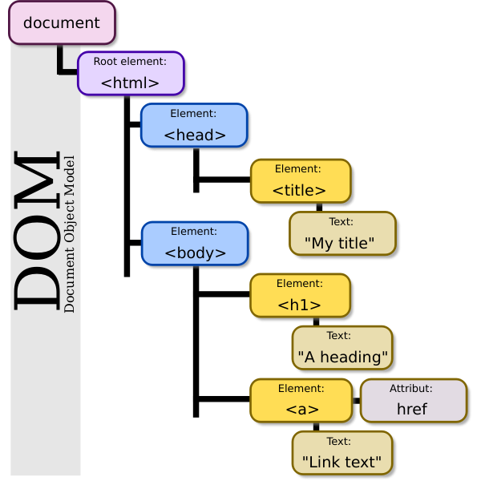

# Web

### 웹 사이트의 구성 요소

- **웹사이트** : 브라우저를 통해서 접속하는 웹 페이즈들의 모음
- **웹페이지** : 글, 그림, 동영상 등 여러가지 정보를 담고 있는 페이지

- **HTML** → 구조 (건물)
- **CSS** → 표현 (인테리어)
- **Javascript** → 동작 (엘리베이터)

<br>
### 웹 표준과 크로스 브라우징

- **웹 표준** : 웹에서 표준적으로 사용되는 기술이나 규칙
- **크로스 브라우징** : 어떤 브라우저든 웹 페이지가 동일하게 보이도록 함

- 브라우저별 호환성 체크 사이트
    
    [Can I use... Support tables for HTML5, CSS3, etc](https://caniuse.com/)
    
<br>
### 개발 환경 설정

- Visual Studio Code
    - Open in browser, Auto rename tag, Highlight Matching Tag
- 크롬 개발자 도구
    - Elements : DOM 탐색 및 CSS 확인 및 변경
        - Styles : 요소에 적용된 CSS 확인
        - Computed : 스타일이 계산된 최종 결과
        - Event Listeners : 해당 요소에 적용된 이벤트 (JS)
        
<br>

---

# HTML

→ **웹 페이지**를 작성(**구조화**)하기 위한 언어 (.html)

- **Hyper Text**
    - **참조**(하이퍼링크)를 통해 사용자가 한 문서에서 다른 문서로 즉시 접근할 수 있는 **텍스트**
- **Markup Language**
    - **태그** 등을 이용하여 문서나 데이터의 **구조**를 명시하는 **언어**

📎마크업 스타일 가이드 : **2 space**


<br>

## HTML 기본구조

```html
<!DOCTYPE html>
<html lang="en">             <!--html : 문서의 최상위(root) 요소-->
<head>                       <!--head : 문서의 메타데이터 요소-->
  <meta charset="UTF-8">       <!--문서 제목, 인코딩, 스타일, 외부 파일 로딩 등-->
  <title>Document</title>      <!--일반적으로 브라우저에 나타나지 않는 내용-->
</head>
<body>                       <!--body : 문서 본문 요소-->
                               <!--실제 화면 구성과 관련된 내용-->
</body>
</html>
```
<br>
### **head**

```html
<head>                                    <!--head : 문서의 메타데이터 요소-->
  <meta charset="UTF-8">                    <!--meta : 문서 레벨 메타데이터 요소-->
  <title>HTML 수업</title>                  <!--title : 브라우저 상단 타이틀-->
  <link href="style.css" rel="stylesheet">  <!--link : 외부 리소스 연결 요소-->
  <script src="javascript.js"></script>     <!--script : 스크립트 요소-->
  <style>                                   <!--style : CSS 직접 작성-->
    p {
      color: black;
    }
  </style>
</head>
```

- Open Graph Protocol
    - 메타 데이터를 표현하는 새로운 규약
    - 메타 데이터를 통해 문서의 정보(제목, 설명, 썸네일 등)를 전달
<br>
### 요소 element

- `<tag>contents</tag>` 태그 + 내용
- 태그를 통해 **그 정보의 성격과 의미를 정의**
- 내용이 없는 태그들도 존재 (닫는 태그가 없음)
    - br, hr, img, input, link, meta
- 요소는 **중첩**nested될 수 있음
    - 중첩을 통해 하나의 문서를 **구조화**
    
    <aside>
    📎 태그의 쌍을 잘 확인해야 함!
    
    </aside>
    
<br>
### 속성 attribute

- `<a 속성명="속성값"></a>`
- 태그의 부가적인 정보를 설정
- 태그별로 사용할 수 있는 속성은 다르다
- 요소의 시작태그에 작성. 보통 이름과 값이 하나의 쌍으로 존재

<aside>
📎 속성 지정 스타일 가이드 : 공백 XXX, “쌍따옴표 사용”

</aside>

- **HTML Global Attribute** : 모든 HTML 요소가 사용 가능
    
    
    | 속성 | 내용 |
    | --- | --- |
    | id | 문서 전체에서 유일한 고유 식별자 지정 |
    | class | 공백으로 구분된 해당 요소의 클래스의 목록 (CSS, JS에서 요소를 선택/접근) |
    | data-* | 페이지에 개인 사용자 정의 데이터를 저장하기 위해 사용 |
    | style | inline 스타일 |
    | title | 요소에 대한 추가 정보 지정 |
    | tabindex | 요소의 탭 순서 |
<br>
### 시맨틱 태그


- HTML 태그가 특정 목적, 역할 및 의미적 가치(semantic value)를 가지는 것
- ex) a, form, table ↔ Non semantic 요소 : div, span
    
    
    | 태그 | 내용 |
    | --- | --- |
    | header | 문서 전체나 섹션의 헤더(머리말 부분) |
    | nav | 내비게이션 |
    | aside | 사이드에 위치한 공간. 메인 콘텐츠와 관련성이 적은 콘텐츠. |
    | section | 문서의 일반적인 구분, 컨텐츠의 그룹을 표현 |
    | article | 문서, 페이지, 사이트 안에서 독립적으로 구분되는 영역 |
    | footer | 문서 전체나 섹션의 푸터(마지막 부분) |
- **의미론적 마크업을 위해**
    - 개발자, 사용자, 검색엔진 최적화(SEO)
    - 요소의 의미가 명확. 코드의 가독성을 높이고 유지보수를 쉽게 함.
<br>
### 렌더링

- 웹사이트 코드를 사용자가 보게 되는 웹 사이트로 바꾸는 과정

### DOM(Document Object Model) 트리



- 텍스트 파일인 HTML 문서를 브라우저에서 렌더링하기 위한 구조
- HTML 문서에 대한 모델 구성
- HTML 문서 내의 각 요소에 접근 / 수정에 필요한 프로퍼티와 메서드 제공
<br>
## HTML 문서 구조화

### 인라인 / 블록 요소

- 인라인 : 글자처럼 취급
- 블록 : 한 줄 모두 사용
<br>
### 텍스트 요소

| 태그 | 설명 |
| --- | --- |
| `<a></a>` | href 속성을 활용하여 하이퍼링크 생성 |
| `<b></b>` | 굵은 글씨 요소 |
| `<strong></strong>` |  |
| `<i></i>` | 기울임 글씨 요소 |
| `<em></em>` |  |
| `<br>` | 텍스트 내에 줄 바꿈 생성 |
| `` | src 속성을 활용하여 이미지 표현 |
| `<span></span>` | 의미 없는 인라인 컨테이너 |
<br>
### 그룹 컨텐츠

| 태그 | 설명 |
| --- | --- |
| `<p></p>` | 하나의 문단 (paragraph) |
| `<hr>` | 수평선 (주제의 분리) |
| `<ol></ol>` | 순서가 있는 리스트 (ordered) |
| `<ul></ul>` | 순서가 없는 리스트 (unordered) |
| `<pre></pre>` | HTML에 작성한 내용을 그대로 표현 (보통 고정폭 글꼴, 공백문자 유지) |
| `<blockquote></blockquote>` | 텍스트가 긴 인용문 (보통 들여쓰기로 표현) |
| `<div></div>` | 의미 없는 블록 레벨 컨테이너 |