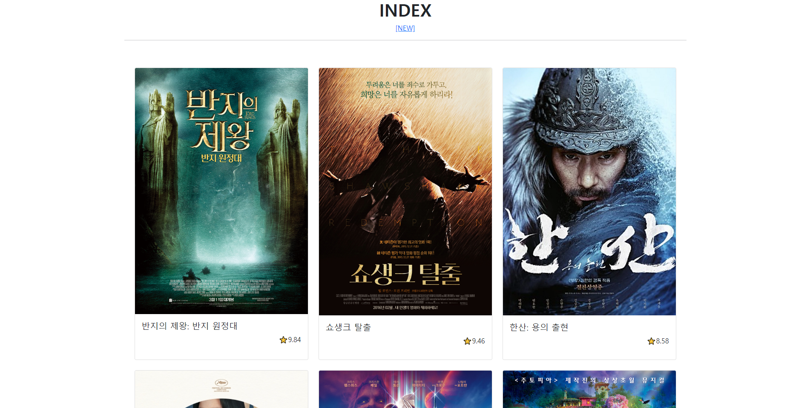
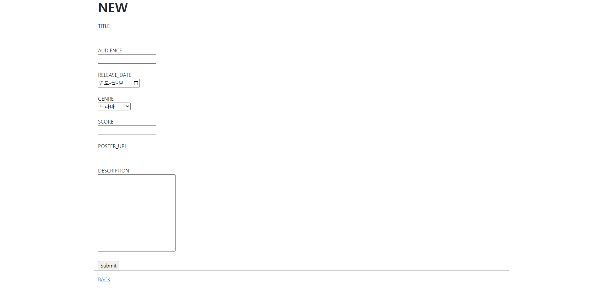
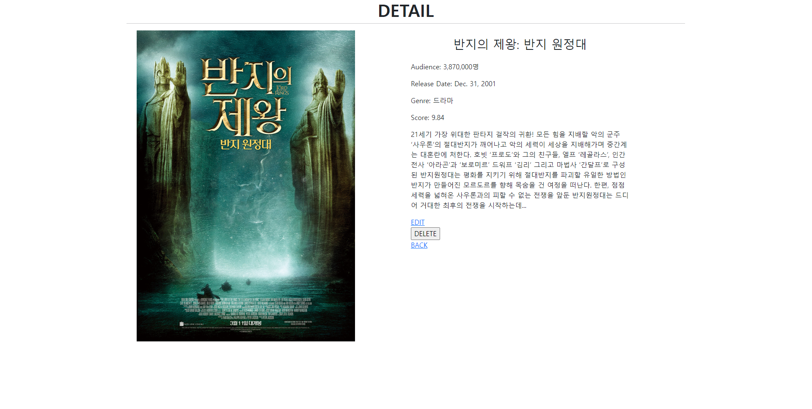
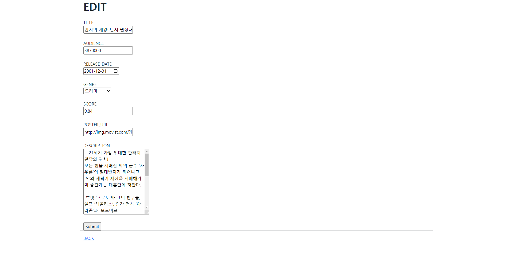

# pjt04 프레임워크 기반 웹 페이지 구현
서울 1반 서다경 220901




---

## view

* movies/views.py
```python
from contextlib import redirect_stderr, redirect_stdout
from multiprocessing import context
from turtle import title
from django.shortcuts import render, redirect
from .models import Movie
# Create your views here.
def index(request):
    movies = Movie.objects.all()
    context = {
        'movies' : movies
    }
    return render(request, 'movies/index.html', context)

def new(request):
    return render(request, 'movies/new.html')

def create(request):
    movie = Movie()
    movie.title = request.POST.get('title')
    movie.audience = request.POST.get('audience')
    movie.release_date = request.POST.get('release_date')
    movie.genre = request.POST.get('genre')
    movie.score = request.POST.get('score')
    movie.poster_url = request.POST.get('poster_url')
    movie.description = request.POST.get('description')
    movie.save()
    return redirect('movies:detail', movie.pk)

def detail(request, pk):
    movie = Movie.objects.get(pk=pk)
    context = {'movie' : movie,}
    return render(request, 'movies/detail.html', context)

def edit(request, pk):
    movie = Movie.objects.get(pk=pk)
    context = {'movie':movie}
    return render(request, 'movies/edit.html', context)

def update(request, pk):
    movie = Movie.objects.get(pk=pk)
    movie.title = request.POST.get('title')
    movie.audience = request.POST.get('audience')
    movie.release_date = request.POST.get('release_date')
    movie.genre = request.POST.get('genre')
    movie.score = request.POST.get('score')
    movie.poster_url = request.POST.get('poster_url')
    movie.description = request.POST.get('description')
    movie.save()
    return redirect('movies:detail', movie.pk)

def delete(request, pk):
    movie = Movie.objects.get(pk=pk)
    movie.delete()
    return redirect('movies:index')
```

---

## templates


* movies/template/movies/index.html
```HTML



  <h1 class="text-center"><b>INDEX</b></h1>
  <p class="text-center"><a href="">[NEW]</a></p>
  <hr>

    <div class="container col-9">
      <div class="row row-cols-1 row-cols-md-3 g-4">

        
          <div class="col">
            <div class="card h-100 text-bg-white d-flex position-relative">
              
              <div class="card-body">
                <h5 class="card-title">{{movie.title}}</h5>
                <p class="card-text text-end">⭐{{movie.score}}</p>
                <a href="" class="stretched-link bg-white border-white"></a>
              </div>
            </div>
          </div>
        

      </div>
    </div>

<br>


```
* 각 개체마다 부트스트랩의 카드그룹을 적용했다.

<br>



* movies/template/movies/new.html

```HTML



  <h1><b>NEW</b></h1>
  <hr>

  <form action="" method="POST">
    

    <label for="title">TITLE</label><br>
    <input type="text" name="title" id="title"><br><br>

    <label for="audience">AUDIENCE</label><br>
    <input type="number" name="audience" id="audience"><br><br>


    <label for="release_date">RELEASE_DATE</label><br>
    <input type="date" name="release_date" id="release_date"><br><br>

    <label for="genre">GENRE</label><br>
    <select name="genre" id="genre">
      <option value="드라마">드라마</option>
      <option value="코미디">코미디</option>
      <option value="액션">액션</option>
      <option value="판타지/SF">판타지/SF</option>
      <option value="애니메이션">애니메이션</option>
    </select><br><br>

    <label for="score">SCORE</label><br>
    <input type="number" step="0.01" name="score" id="score"><br><br>

    <label for="poster_url">POSTER_URL</label><br>
    <input type="url" name="poster_url" id="poster_url"><br><br>

    <label for="description">DESCRIPTION</label><br>
    <textarea name="description" id="description" cols="30" rows="10"></textarea><br><br>

    <input type="submit" value="Submit">

  </form><br><br>

  <hr>
  <a href="">BACK</a>


```

<br>


* movies/template/movies/detail.html
```HTML





  <h1 class="text-center"><b>DETAIL</b></h1>
  <hr>

  <div class="row px-7">
    <br><br>

    <div class="col-5 align-items-center mx-auto">
      <h3 class="text-center py-3">{{movie.title}}</h3>

      <p>Audience: {{movie.audience|intcomma}}명</p>
      <p>Release Date: {{movie.release_date}}</p>
      <p>Genre: {{movie.genre}}</p>
      <p>Score: {{movie.score}}</p>
      <p>{{movie.description}}</p>

      <a href="">EDIT</a>

      <form action="" method="POST">
        
        <input type="submit" value="DELETE">
      </form>
      <a href="">BACK</a>
    </div>
    
  </div>


```

<br>


* movies/template/movies/edit.html
```HTML



  <h1><b>EDIT</b></h1>
  <hr>

  <form action="" method="POST">
    

    <label for="title">TITLE</label><br>
    <input type="text" name="title" id="title" value="{{movie.title}}"><br><br>

    <label for="audience">AUDIENCE</label><br>
    <input type="number" name="audience" id="audience" value="{{movie.audience}}"><br><br>


    <label for="release_date">RELEASE_DATE</label><br>
    <input type="date" name="release_date" id="release_date" value="{{movie.release_date|date:'Y-m-d'}}" required><br><br>

    <label for="genre">GENRE</label><br>
    <select name="genre" id="genre">
      <option value="{{movie.genre}}">{{movie.genre}}</option>
      <option value="드라마">드라마</option>
      <option value="코미디">코미디</option>
      <option value="액션">액션</option>
      <option value="판타지/SF">판타지/SF</option>
      <option value="애니메이션">애니메이션</option>
    </select><br><br>

    <label for="score">SCORE</label><br>
    <input type="number" step="0.01" name="score" id="score" value="{{movie.score}}"><br><br>

    <label for="poster_url">POSTER_URL</label><br>
    <input type="url" name="poster_url" id="poster_url" value="{{movie.poster_url}}"><br><br>

    <label for="description">DESCRIPTION</label><br>
    <textarea name="description" id="description" cols="30" rows="10"> {{movie.description}} </textarea><br><br>

    <input type="submit" value="Submit">

  </form><br><br>

  <hr>
  <a href="">BACK</a>


```

---

## Review

#### 💡 새로 배운 것들

##### 1. edit시 기존 날짜 데이터를 기본 데이터로 설정하기
```HTML
<label for="release_date">RELEASE_DATE</label><br>
<input type="date" name="release_date" id="release_date" value="{{movie.release_date|date:'Y-m-d'}}" required>
```
* value 설정시 날짜 형식을 맞춰야 데이터가 입력된다.

<br>

##### 2. edit시 기존 콤보상자 선택지를 기본 데이터로 설정하기
```HTML
<select name="genre" id="genre">
  <option value="{{movie.genre}}">{{movie.genre}}</option>
  <option value="드라마">드라마</option>
  <option value="코미디">코미디</option>
  <option value="액션">액션</option>
  <option value="판타지/SF">판타지/SF</option>
  <option value="애니메이션">애니메이션</option>
</select><br><br>
```
* select를 이용했다.
* 처음엔 value 값을 설정하지 않아 데이터가 비었다. 데이터를 꼼꼼히 채워줘야 한다. 

##### 3. 함수 투입과 산출을 생각하면 views가 쉽다.

##### 4. int형식 지정하기
```python
#settings.py
INSTALLED_APPS = [
    'movies',
    'django_extensions',
    'django.contrib.humanize',
    ...]
```
```HTML
<!-- 상단 -->
 
...
<p>Audience: {{movie.audience|intcomma}}명</p>
```
* 숫자에 쉼표 기호를 넣고 싶을 때는 이렇게 설정하면 된다.

---

### 느낀 점

* 서버를 구현하고 부트스트랩을 적용하자 비교적 완성된 웹 페이지를 만들 수 있어서 좋았다.
* 부트스트랩과 css, HTML을 많이 잊어서 복습이 필요할 것 같다.
* New나 Edit처럼 사용자가 직접 사용하는 웹페이지는 어떻게 하면 더 편리한지 유심히 살펴보고 싶다.
* 기존 값에 따라 콤보박스의 selected 를 수정하고 싶었지만 JavaScript가 필요했다. 이후 배워서 보완하고 싶다.
