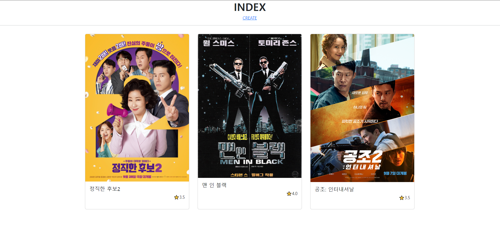
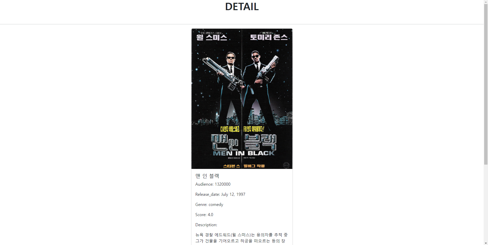
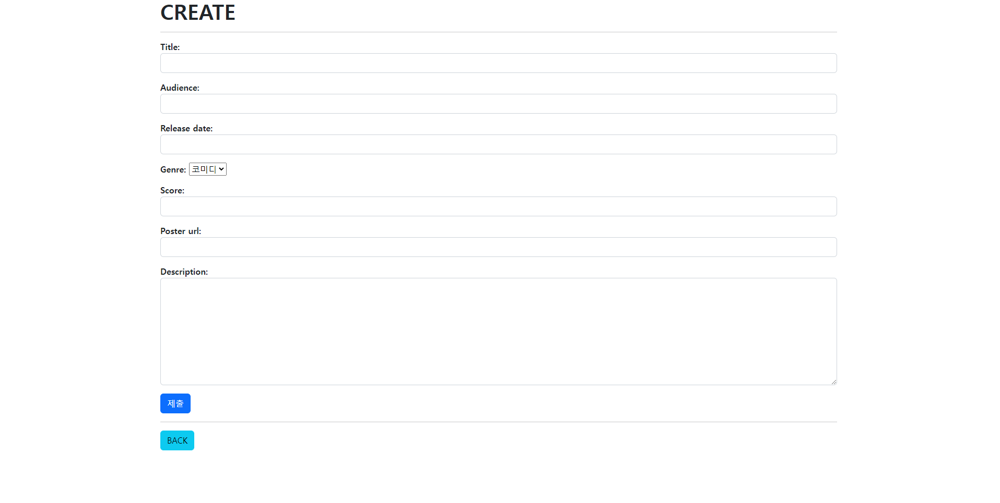
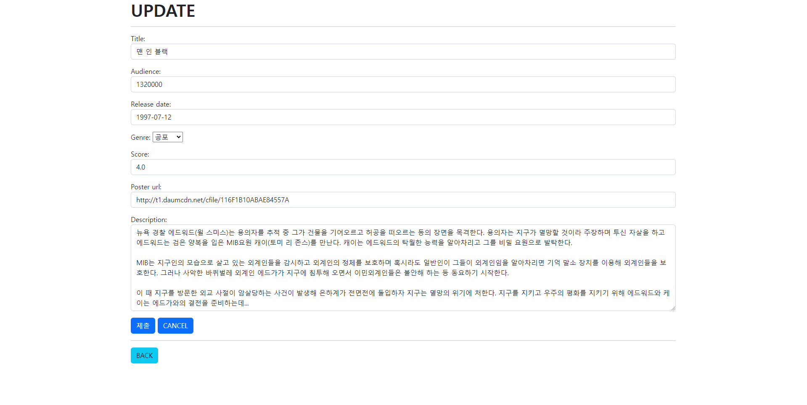

# pjt05 DB를활용한웹페이지구현
서울 1반 서다경 221007




---


## model
#### 💡 새로 구현한 것들
* 선택자가 있는 특성(Genre)을 모델에서 구현했다.
```python
from django.db import models
from datetime import date
from django import forms

# Create your models here.
class Movie(models.Model):
    title = models.CharField(max_length=20)
    audience = models.IntegerField()
    release_date = models.DateField(default=date.today)
    GENRE_CHOICES = [
        ('comedy', '코미디'),
        ('horror', '공포'),
        ('romance', '로맨스'),
    ]
    genre = models.CharField(
        max_length=30, choices=GENRE_CHOICES, default='comedy',
        )
    score = models.FloatField()
    poster_url = models.TextField()
    description = models.TextField()

    def __str__(self):
        return self.title
```

---

## view
#### 💡 새로 구현한 것들
* CRUD를 구현하고 decorator도 추가했다.

```python
# movies/views.py
from django.shortcuts import render, redirect
from .models import Movie
from .forms import MovieForm
from django.views.decorators.http import require_http_methods, require_GET

@require_GET
def index(request):
    movies = Movie.objects.all()
    context = {
        'movies': movies,
    }
    return render(request, 'movies/index.html', context)


@require_http_methods(["GET", "POST"])
def create(request):
    if request.method == 'POST':
        form = MovieForm(request.POST)
        if form.is_valid():
            movie = form.save()
            return redirect('movies:detail', movie.pk)
    else:
        form = MovieForm()
    context = {
        'form': form,
    }
    return render(request, 'movies/create.html', context)


@require_GET
def detail(request, pk):
    movie = Movie.objects.get(pk=pk)
    context = {
        'movie': movie,
    }
    return render(request, 'movies/detail.html', context)


@require_http_methods(["GET", "POST"])
def update(request, pk):
    movie = Movie.objects.get(pk=pk)
    if request.method == 'POST':
        form = MovieForm(request.POST, instance=movie)
        if form.is_valid():
            form.save()
            return redirect('movies:detail', movie.pk)
    else:
        form = MovieForm(instance=movie)
    context = {
        'movie': movie,
        'form': form,
    }
    return render(request, 'movies/update.html', context)


@require_GET
def delete(request, pk):
    movie = Movie.objects.get(pk=pk)
    movie.delete()
    return redirect('movies:index')
```

---

## forms
#### 💡 새로 구현한 것들

* 부트스트랩의 form control 스타일을 forms에 위젯으로 적용해주었다.



```python
from django import forms
from .models import Movie

class MovieForm(forms.ModelForm):
    title = forms.CharField(
        max_length=20,
        widget=forms.TextInput(
            attrs={
                'class': 'form-control',
            }
        )
    )
    audience = forms.IntegerField(
        widget=forms.NumberInput(
            attrs={
                'class': 'form-control',
            }
        )
    )
    release_date = forms.DateField(
        widget=forms.DateInput(
            attrs={
                'class': 'form-control',
            }
        )
    )
    poster_url = forms.CharField(
        widget=forms.TextInput(
            attrs={
                'class': 'form-control',
            }
        )
    )
    description = forms.CharField(
        widget=forms.Textarea(
            attrs={
                'class': 'form-control',
                'rows' : 8,
            }
        )
    )
    score = forms.FloatField(
        max_value=5.0,
        min_value=0.0, 
        widget=forms.NumberInput(
            attrs={
                'id': 'form_score',
                'step': "0.5",
                'class': 'form-control',
            }
        ),
    )

    class Meta:
        model = Movie
        fields = '__all__'
```

---


# templates
#### 💡 새로 구현한 것들
* reset 버튼을 추가하였다.

```html
# movies/templpates/movies/update.html


  <h1><b>UPDATE</b></h1>
  <hr>

  <form action="" method="POST">
    
    {{ form.as_p }}
    <input type="submit" class="btn btn-primary">
    <input type="reset" class="btn btn-primary" value="CANCEL">
  </form>
  <hr>
  <a href="" class="btn btn-info">BACK</a>


```
---


### 느낀 점
* CRUD 구현에 제법 익숙해져서 뿌듯하다.
* widget 구현시 공식 문서를 활용하였다. 생각보다 더 어려움이 있었다... 익숙해질 때까지 자주 써야할 것 같다.
* 디자인 및 프론트 구현이 생각보다 까다롭다. 부스트트랩 복습이 필요하다.
* 부트스트랩과 장고를 연결하는 extension이 있다고 하는데 다음에는 찾아봐야겠다. 코드가 너무 반복되었다!
