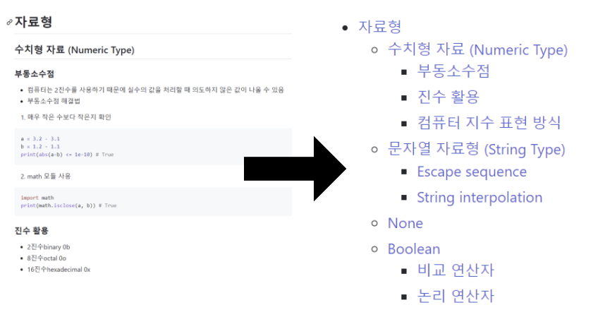

# 마크다운 자동목차 만들기



* TIL 내용의 목차를 자동으로 만들어주는 파이썬 코드입니다.
* 목차를 누르면 해당 내용으로 이동합니다.
* 목차에 ? 등 특수문자가 들어가면 링크가 작동되지 않을 수도 있습니다!
* 예시 : [(220718) Python 기초](https://github.com/seoda0000/TIL/blob/master/Python/Python_Basic.md)

## How to use

- git의 코드를 파이썬으로 돌립니다.
- input에 전체 마크다운 내용을 입력하면 output으로 자동 목차가 생성됩니다. 이를 md 형식 문서에 붙여넣으시면 됩니다.
- 주피터 노트북 사용을 권장합니다. bash에서 쓸 때는 주소창 등에 붙여넣기해서 input을 한 줄로 만들어주세요.


## code
```
# input으로 받아 리스트 만들기
entire_md = list(input().split("  "))

# 공백 제거하기
t_md = []
for item in entire_md:
    if len(item) >= 1:
        t_md.append(item.strip())

# 코드블럭 제거하기
c_lst = []
a = 1
for i in t_md:
    if "```" in i:
        a *= -1
    if a > 0:
        c_lst.append(i)
    
        
# #으로 시작하는 목차 추출하기
table_md = []
for item in c_lst:
    if item[0] == "#":
        table_md.append(item)

# 링크 목차 구성하기
out = ""
for item in table_md:
    if "`" not in item:
        if "###" in item:
            out += "    + [" + item[4:] + "](#" + item[4:].replace(" ", "-") + ")\n"
        elif "##" in item:
            out += "  * [" + item[3:] + "](#" + item[3:].replace(" ", "-") + ")\n"
        elif "#" in item:
            out += "- [**" + item[2:] + "**](#" + item[2:].replace(" ", "-") + ")\n"
print(out)
```

### update & upcoming

- (220720) 코드블럭 오류 제거
- (220728) 제목 색 Bold 처리

- bash에서 여러줄 입력 받기
- 웹 작업!